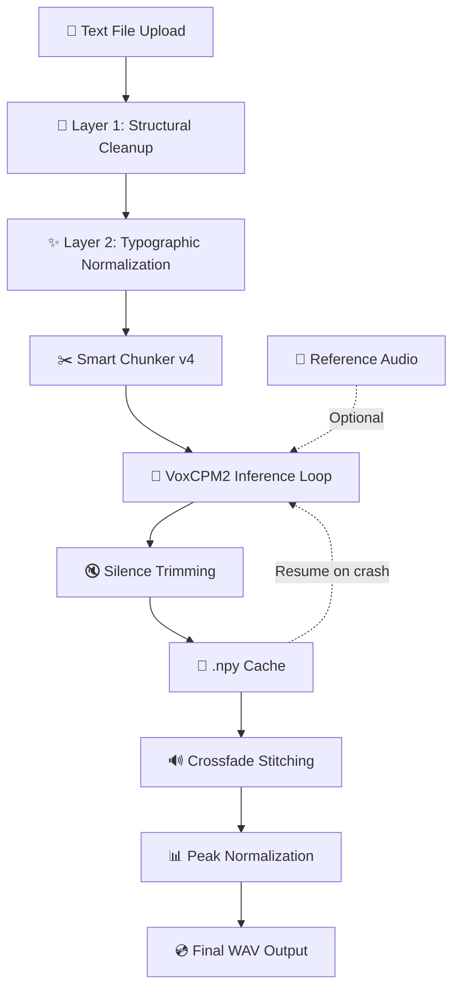

# ⬡ J.A.R.V.I.S. VoxCPM2 TTS v4 — Complete Deep-Dive Guide

> **Yeh guide tere notebook ke saath side-by-side padhne ke liye hai.**
> Left mein yeh guide, right mein notebook — line-by-line samjho, own karo.

---

## 📖 Table of Contents

1. [Big Picture — Notebook Kya Karta Hai?](#big-picture)
2. [Architecture Overview — Pipeline Ka Flow](#architecture)
3. [Cell 1 — System Diagnostics (Boot Sequence)](#cell-1)
4. [Cell 2 — Install Dependencies](#cell-2)
5. [Cell 3 — Upload Text + Preprocessing](#cell-3)
6. [Cell 4 — Reference Audio (Voice Cloning)](#cell-4)
7. [Cell 5 — TTS Configuration](#cell-5)
8. [Cell 6 — Load Model + Generate TTS (THE BEAST)](#cell-6)
   - [6A. Audiobook Chunker v4](#cell-6a)
   - [6B. Silence Trimmer (Bug-004)](#cell-6b)
   - [6C. Crossfade Stitcher (Bug-002 + Bug-003)](#cell-6c)
   - [6D. Model Loading + Inference Loop](#cell-6d)
   - [6E. Stitch + Save + Peak Normalize](#cell-6e)
9. [Cell 7 — Playback & Download](#cell-7)
10. [Bug Registry — Saare 6 Bugs Ka Postmortem](#bugs)
11. [DSP Concepts Cheat-Sheet](#dsp)
12. [Interview Q&A Bank](#interview)

---

<a id="big-picture"></a>
## 1. 🎯 Big Picture — Notebook Kya Karta Hai?

**One-liner:** Yeh notebook ek long Hindi/Hinglish text file (jaise book ka chapter) leti hai, aur usse production-quality audiobook WAV file mein convert karti hai.

### Kya-kya hota hai andar?

```
Text File (.txt)
    │
    ▼
┌─────────────────────────────────────┐
│  PREPROCESSING                      │
│  • Unicode cleanup (NFC, ZW chars)  │
│  • Typographic normalization        │
│  • Smart quotes → straight quotes   │
└────────────┬────────────────────────┘
             │
             ▼
┌─────────────────────────────────────┐
│  SMART CHUNKING                     │
│  • Paragraph → Sentence → Clause   │
│  • Min/Max chunk enforcement        │
│  • Chapter heading detection        │
│  • Terminal punctuation guarantee   │
│  • Style cue propagation            │
└────────────┬────────────────────────┘
             │
             ▼
┌─────────────────────────────────────┐
│  VoxCPM2 INFERENCE (per chunk)      │
│  • 2B parameter TTS model           │
│  • Optional voice cloning           │
│  • 3-attempt retry with VRAM mgmt   │
│  • Checkpoint/resume to disk (.npy) │
└────────────┬────────────────────────┘
             │
             ▼
┌─────────────────────────────────────┐
│  POST-PROCESSING                    │
│  • Silence trimming (Bug-004)       │
│  • Hanning crossfade (Bug-002/003)  │
│  • Silence gaps (chapter/para/sent) │
│  • Peak normalization (-1 dBFS)     │
└────────────┬────────────────────────┘
             │
             ▼
     Final .WAV (48 kHz, PCM_16)
```

### Key Tech Stack:

| Component | Kya hai | Kyun use kiya |
|-----------|---------|---------------|
| **VoxCPM2** | OpenBMB ka 2B-param TTS model | 30 languages support, 48 kHz output, voice cloning |
| **PyTorch** | Deep learning framework | Model inference GPU pe |
| **NumPy** | Numerical arrays | Audio waveform manipulation |
| **SoundFile** | Audio I/O library | WAV read/write |
| **Google Colab** | Cloud notebook + GPU | Free T4 GPU (16 GB VRAM) |

---

<a id="architecture"></a>
## 2. 🏗️ Architecture Overview — Pipeline Ka Flow



**Production concerns jo yeh notebook handle karti hai:**
1. **Long text** → Chunking (VoxCPM2 ka context limit ~480 chars)
2. **Choppy audio** → Crossfade stitching with Hanning window
3. **Click artifacts** → Fade-in/fade-out, silence trimming
4. **VRAM crashes** → 3-attempt retry + checkpoint/resume
5. **Unnatural pauses** → Smart silence gaps (chapter/para/sentence/clause)
6. **Inconsistent volume** → Peak normalization to -1 dBFS

---

<a id="cell-1"></a>
## 3. 🔧 Cell 1 — System Diagnostics (Boot Sequence)

### Purpose
Colab environment check karo before kuch bhi run karo. GPU hai? VRAM enough hai? Disk space hai?

### Code Walkthrough

#### Dashboard Helper Functions (`_esc`, `_panel`, `_banner`, `_alert`, `_pbar`)

Yeh **5 utility functions** hai jo JARVIS-style Iron Man dashboard UI banate hai. In-notebook HTML render karte hai.

```python
def _esc(s):
    return str(s).replace("&","&amp;").replace("<","&lt;").replace(">","&gt;")
```
**Kya karta hai:** HTML entity escaping. Agar kisi text mein `<` ya `&` ho toh browser usse HTML tag samjh lega — toh escape karo.

> **Interview tip:** Yeh XSS (Cross-Site Scripting) prevention ka basic concept hai. Display ke liye user-provided string show karte ho toh ALWAYS escape karo.

```python
def _panel(title, rows, accent="#e74c3c", note="", width="700px"):
```
**Kya karta hai:** Ek styled HTML table panel banata hai. `rows` list mein 3 tarah ke elements aa sakte hai:
- **`None`** → horizontal divider line
- **`str`** → section header (like "GPU STATUS")
- **`tuple (label, value, status)`** → data row with optional status color

Status colors automatic detect hote hai:
- ✅/OK/ONLINE → Green (`#2ecc71`)
- ⚠/WARN/LOW → Yellow (`#f39c12`)  
- ❌/FAIL/OFFLINE → Red (`#e74c3c`)

```python
def _banner(l1, l2="", l3=""):
```
**Kya karta hai:** Big header banner — har cell ke top pe dikhai deta hai. Iron Man HUD jaisa look.

```python
def _alert(msg, level="info"):
```
**Kya karta hai:** Color-coded alert box. `info` (blue), `success` (green), `warn` (yellow), `error` (red).

```python
def _pbar(pct, label="", color="#e74c3c"):
```
**Kya karta hai:** CSS-based progress bar. `pct` percentage value (0-100), bar fill hota hai.

> ☝️ **Important:** Yeh sab functions `Cell 1` mein define hote hai but **baaki SAARE cells mein use hote hai** (Colab mein ek cell ke globals dusre cells ko accessible hote hai). Isliye Cell 1 hamesha pehle run karna zaroori hai.

#### Diagnostics Section

```python
gpu_ok = False
# ...
raw = subprocess.check_output(
    ["nvidia-smi","--query-gpu=name,memory.total,memory.free,driver_version",
     "--format=csv,noheader"], encoding="utf-8").strip().split(",")
```
**Kya karta hai:** `nvidia-smi` CLI tool call karke GPU info nikalte hai:
- GPU name (e.g., "Tesla T4")
- Total VRAM (e.g., "15360 MiB")
- Free VRAM
- Driver version

```python
vmb = int("".join(c for c in vt if c.isdigit()))
gpu_ok = vmb >= 7000
```
**Kya karta hai:** VRAM string se sirf digits nikalo (e.g., "15360 MiB" → 15360), check karo ki 7 GB se zyada hai ya nahi. VoxCPM2 ko ~7-8 GB VRAM chahiye.

PyTorch + CUDA check bhi similar hai — `torch.cuda.is_available()` se GPU accessible hai ya nahi.

Disk space check:
```python
dk = subprocess.check_output(["df","-h","/"], encoding="utf-8").strip().split("\n")[-1].split()
```
**Kya karta hai:** `df -h /` Linux command se root partition ki disk usage nikalte hai. Model download mein ~15 GB lagta hai first run pe.

### Cell 1 Summary
| Check | Kyun Zaroori |
|-------|-------------|
| GPU present? | VoxCPM2 GPU ke bina bohot slow hai |
| VRAM ≥ 7 GB? | Model + denoiser ~7-8 GB VRAM |
| Disk space? | Model weights ~15 GB download |
| PyTorch + CUDA? | GPU inference ke liye |

---

<a id="cell-2"></a>
## 4. 📦 Cell 2 — Install Dependencies

### Purpose
Saari zaruri Python libraries install karo.

### Code Walkthrough

```python
PACKAGES = [
    ("voxcpm",          "VoxCPM2 core TTS library",       True),
    ("transformers",    "HuggingFace model loader",        False),
    # ...
]
```
**Structure:** Har entry mein `(package_name, description, should_upgrade)`.
- `True` = `--upgrade` flag ke saath install (latest chahiye)
- `False` = already hai toh skip, nahi hai toh install

**`voxcpm`** ko `upgrade=True` rakha hai kyunki yeh actively developing library hai — latest version chahiye.

```python
for i, (pkg, desc, upgrade) in enumerate(PACKAGES, 1):
    flags = ["--upgrade"] if upgrade else []
    result = subprocess.run(
        [sys.executable, "-m", "pip", "install", pkg, "-q"] + flags,
        capture_output=True, text=True)
```

**Kya karta hai:** Har package ko `pip install` karta hai:
- `sys.executable` = currently running Python interpreter ka path (yeh ensure karta hai ki sahi Python mein install ho)
- `-m pip` = pip ko module ke roop mein run karo (best practice)
- `-q` = quiet mode (kam output)
- `capture_output=True` = stdout/stderr capture karo (display clutter avoid karne ke liye)

**Import Verification:**
```python
verify = [("voxcpm", None), ("soundfile", None), ...]
for mod, _ in verify:
    m = __import__(mod)
    ver = getattr(m, "__version__", "ok")
```
**Kya karta hai:** Install ke baad actually `import` karke check karo — kabhi kabhi `pip install` succeed hota hai but import fail hota hai (e.g., missing C library).

> **Interview insight:** `__import__("module_name")` dynamic import hai — string se module import kar sakte ho. Production code mein `importlib.import_module()` preferred hai, but quick checks ke liye `__import__` works.

### Packages Ka Role:

| Package | Role | Interview mein kya bolna hai |
|---------|------|------------------------------|
| `voxcpm` | TTS model wrapper | OpenBMB ka official Python SDK for VoxCPM2 |
| `transformers` | HuggingFace model loading | Tokenizer + model architecture definitions |
| `accelerate` | GPU memory management | Mixed precision, device placement |
| `huggingface_hub` | Model download | Cached download from HF Hub |
| `soundfile` | Audio I/O | libsndfile wrapper, WAV/FLAC/OGG read/write |
| `scipy` | Signal processing | Used internally by audio libs |
| `librosa` | Audio analysis | Spectrogram, feature extraction |
| `numpy` | Numerical computing | Waveform arrays, DSP operations |
| `tqdm` | Progress bars | Terminal progress display |
| `ipywidgets` | Colab UI | Interactive widgets |

---

<a id="cell-3"></a>
## 5. 📝 Cell 3 — Upload Text + Preprocessing

### Purpose
Text file upload karo, clean karo, normalize karo. Yeh cell **2-layer preprocessing pipeline** implement karti hai.

### The Normalization Toggle
```python
ENABLE_NORMALIZATION = True  # @param {type:"boolean"}
```
Colab mein `# @param` ek UI toggle/widget bana deta hai — user GUI se on/off kar sakta hai.

**Kyun toggle hai?** Agar text already professionally edited hai (jaise publisher-grade manuscript) toh Layer 2 off rakho — warna extra normalization original formatting bigaad sakti hai.

---

### Layer 1: `_clean_text()` — ALWAYS runs

```python
def _clean_text(text):
```

Yeh function **structural cleanup** karta hai — koi bhi text source ho (OCR, web scraping, manual typing), yeh safe cleanup hai.

**Step-by-step:**

**① Separator line removal:**
```python
text = re.sub(r"(?m)^[ \t]*[=\-]{5,}[ \t]*$", "", text)
```
**Regex breakdown:**
- `(?m)` = multiline mode (`^` aur `$` har line ke start/end pe match kare)
- `^[ \t]*` = line start pe optional spaces/tabs
- `[=\-]{5,}` = 5 ya zyada `=` ya `-` characters
- `[ \t]*$` = line end pe optional spaces/tabs

**Kyun:** Books mein chapter separators hote hai jaise `==========` ya `----------`. Yeh spoken content nahi hai — hataao. Blank line reh jaayegi jo paragraph boundary ban jaayegi (natural pause).

> **Comment mein likha hai:** "Must happen BEFORE whitespace-collapse" — kyunki agar pehle whitespace collapse karo toh `"TITLE\n======"` ek single line ban jaayega aur separator detect nahi hoga.

**② Unicode NFC normalization:**
```python
text = unicodedata.normalize("NFC", text)
```
**Kya hai NFC?** Unicode mein ek hi character ko multiple ways se represent kar sakte ho:
- **Decomposed (NFD):** `क` + `ा` = two code points
- **Composed (NFC):** `का` = one code point

NFC "Canonical Decomposition → Canonical Composition" karta hai — matlab pehle decompose karo, phir best composed form mein wapas laao.

**Kyun zaroori hai Hindi TTS mein?** Devanagari vowel marks (मात्राएँ) ko correctly compose karna zaroori hai warna model ko alag-alag representations se confusion hoga.

> **Interview gold:** "NFC normalization ensures that visually identical strings have identical byte representations — critical for consistent tokenization in NLP/TTS models."

**③ Zero-width character removal:**
```python
text = re.sub(r"[\u00ad\u200b\u200c\u200d\u2060\ufeff]", "", text)
```
| Code Point | Name | Kyun Problem |
|------------|------|-------------|
| `\u00ad` | Soft Hyphen | Invisible line-break hint, TTS ko confuse karta hai |
| `\u200b` | Zero-Width Space | Invisible separator, tokenizer ko break karta hai |
| `\u200c` | Zero-Width Non-Joiner | Hindi mein sometimes OCR se aata hai |
| `\u200d` | Zero-Width Joiner | Emoji sequences mein use hota hai, text mein unwanted |
| `\u2060` | Word Joiner | Word-break hint, TTS ke liye irrelevant |
| `\ufeff` | BOM (Byte Order Mark) | UTF-8 file ke start mein kabhi kabhi hota hai |

**④ Whitespace cleanup:**
```python
text = re.sub(r"[ \t]+", " ", text)          # multiple spaces → one space
text = re.sub(r"\n{3,}", "\n\n", text)       # max 2 blank lines
text = "\n".join(line.rstrip() for line in text.split("\n"))  # trailing whitespace remove
```

---

### Layer 2: `_normalize_text()` — Optional (toggle ke saath)

Yeh **typographic normalization** hai — text ko clean, consistent punctuation format mein laata hai.

**① Smart/curly quotes → straight ASCII:**
```python
replacements = [
    ("\u2018","'"), ("\u2019","'"), ...  # single quotes
    ("\u201c",'"'), ("\u201d",'"'), ...  # double quotes
    ("\u2039","'"), ("\u203a","'"), ...  # guillemets
]
```
**Kyun?** Microsoft Word aur Google Docs automatically curly quotes (`"` `"` `'` `'`) daalte hai. TTS model ke tokenizer ko inconsistent quote styles se problem hoti hai.

> **Fun fact:** Guillemets (`«` `»`) French/Russian style quotes hai — kabhi kabhi Hindi books mein bhi use hote hai.

**② Dash normalization:**
```python
text = text.replace("\u2013", "-")        # en-dash → hyphen
text = re.sub(r"-{3,}", "\u2014", text)   # --- → em-dash
```
- **En-dash (–):** Number ranges ke liye (e.g., "pages 10–20"). TTS ke liye normal hyphen sufficient hai.
- **Em-dash (—):** Narrative pause ke liye (e.g., "वो आया — और चला गया"). Yeh RAKHO kyunki TTS model isse natural pause samajhta hai.

**③ Ellipsis normalization:**
```python
text = text.replace("\u2026", "...")   # … → ...
```
Unicode ellipsis character (ek single character) ko 3 dots mein convert karo — consistent tokenization ke liye.

**④ Punctuation spacing fix (Bug-006 connected):**
```python
# Remove stray space BEFORE punctuation
text = re.sub(r" +([।.!?,;:])", r"\1", text)

# Ensure space AFTER sentence-ending marks
text = re.sub(r"([।.!?])([^\s\n।.!?\x22\x27\)\]\}\u2019\u201d\u00bb\u203a])", r"\1 \2", text)
```
**Line 1:** "hello ." → "hello." (extra space hatao punctuation se pehle)

**Line 2:** "hello.world" → "hello. world" (space daalo punctuation ke baad) **BUT** closing quotes/brackets ke baad space mat daalo:
- `।"` ke beech mein space mat daalo (Bug-006 fix — iske baare mein aage detail mein)

**⑤ Repeated punctuation cap:**
```python
text = re.sub(r"([।!?]){3,}", r"\1\1", text)   # !!!!! → !!
text = re.sub(r"\.{4,}", "...", text)            # ........ → ...
```
3+ repeated marks ko 2 pe cap karo (model ke liye excessive punctuation confusing hai).

---

### Upload + Stats

```python
uploaded = files.upload()  # Colab file upload dialog
```
```python
raw_text = raw.decode("utf-8")
```
Uploaded file bytes ko UTF-8 string mein decode karo. Agar kuch bytes invalid hai toh `errors="replace"` se `U+FFFD` (�) se replace karo.

**3 versions of text rakhte hai:**
```python
INPUT_TEXT_RAW   = raw_text.strip()                                    # original
INPUT_TEXT_CLEAN = _clean_text(INPUT_TEXT_RAW)                          # Layer 1 only
INPUT_TEXT       = preprocess_for_tts(INPUT_TEXT_RAW, normalize=...)    # Layer 1 + optional Layer 2
```

**Diff counter:**
```python
def _count_diffs(a, b):
    from difflib import SequenceMatcher
    sm = SequenceMatcher(None, a, b, autojunk=False)
    return sum(max(j1-i1, j2-i2) for tag, i1, i2, j1, j2 in sm.get_opcodes()
               if tag != "equal")
```
**Kya karta hai:** Do strings ke beech kitne characters change hue — yeh count karta hai. `SequenceMatcher` longest common subsequence algorithm use karta hai. `get_opcodes()` se `('replace', i1, i2, j1, j2)` jaise tuples aate hai — replace/insert/delete operations ka count.

**Word count se audio duration estimate:**
```python
est_audio = word_count / 130   # approx 130 wpm Hindi audiobook narration
```
Hindi audiobook narration typically ~130 words per minute hoti hai.

---

<a id="cell-4"></a>
## 6. 🎵 Cell 4 — Reference Audio (Voice Cloning)

### Purpose
Optional voice cloning ke liye reference audio upload karo.

### 3 Modes:

| Mode | Reference Audio | Transcript | Quality |
|------|----------------|-----------|---------|
| **Default TTS** | ❌ | ❌ | VoxCPM2 built-in voice |
| **Voice Clone** | ✅ | ❌ | Reasonable voice match |
| **Ultimate Clone** | ✅ | ✅ | Best voice fidelity |

### Code Walkthrough

**Non-WAV conversion:**
```python
if ref_ext != ".wav":
    r = subprocess.run(
        ["ffmpeg", "-y", "-i", ref_save, "-ar", "16000", "-ac", "1", wav_out],
        capture_output=True)
```
**Kya karta hai:** FFmpeg se non-WAV files (MP3, FLAC, OGG, M4A) ko convert karo:
- `-y` = overwrite without asking
- `-ar 16000` = 16 kHz sample rate (VoxCPM2 reference audio ke liye optimal)
- `-ac 1` = mono channel

**Audio quality analysis:**
```python
data, sr = sf.read(ref_save, always_2d=False)
dur = len(data) / sr
peak_val = float(np.abs(data).max())
```
- `sf.read()` audio file ko numpy array mein load karta hai
- `len(data) / sr` = total samples ÷ sample rate = duration in seconds
- `np.abs(data).max()` = peak amplitude (0.0 to 1.0 range mein)

**Duration recommendations:**
- < 8s → "VERY SHORT" (model ko enough voice characteristics nahi milenge)
- 8-30s → "OK" (ideal range)
- > 30s → "LONG" (unnecessary, 10-20s best hai)

**Peak level check:**
- > 0.05 → OK
- ≤ 0.05 → "VERY QUIET" (signal too weak for reliable cloning)

**Mode detection logic:**
```python
mode = ("Ultimate Clone" if REFERENCE_WAV_PATH and PROMPT_TEXT
        else "Voice Clone"    if REFERENCE_WAV_PATH
        else "Default TTS")
```
Simple conditional chain — dono hai toh Ultimate, sirf audio hai toh Voice Clone, kuch nahi toh Default.

> **Interview tip:** Voice cloning mein reference audio + transcript dono dene se model ko **phoneme-to-voice mapping** better samajh aata hai — isliye "Ultimate Clone" better quality deta hai.

---

<a id="cell-5"></a>
## 7. ⚙️ Cell 5 — TTS Configuration

### Purpose
Saare tunable parameters ek jagah define karo. **USER CONFIG** block — sirf yahi edit karna hai.

### Parameters Deep Dive

#### Chunk Size
```python
CHUNK_SIZE     = 380   # recommended: 320-420
MIN_CHUNK_SIZE = 80    # recommended: 60-100
```

**CHUNK_SIZE** (max chars per TTS call):
- VoxCPM2 ka safe context limit ~480 chars hai
- 380 chars pe natural prosody milti hai — model ko enough context hai sentence flow samajhne ke liye
- Too short (< 150) = choppy, robotic joins
- Too long (> 450) = VRAM spikes on T4 (16 GB), possible OOM

**MIN_CHUNK_SIZE** (orphan chunk merger threshold):
- Agar koi chunk 80 chars se chhota hai, toh previous chunk ke saath merge karo
- "कहाँ?" jaise 7-char fragments degenerate audio produce karte hai
- Model ko minimum context chahiye natural speech generate karne ke liye

> **Interview:** "We chose 380 characters as a sweet spot — long enough for the model to establish prosodic patterns across 2-3 sentences, but short enough to avoid VRAM pressure on consumer GPUs like T4."

#### Inference Quality
```python
INFERENCE_TIMESTEPS = 32
CFG_VALUE = 2.0
```

**INFERENCE_TIMESTEPS** — Diffusion model ke denoising steps:
- VoxCPM2 ek **diffusion-based TTS** model hai (like DALL-E but for audio)
- Diffusion models pure noise se start karte hai, gradually denoise karte hai
- More steps = better quality but slower
- 10 = draft (fast, rough), 20 = balanced, 32 = best (commercial quality)

**CFG_VALUE** — Classifier-Free Guidance strength:
- CFG controls karta hai ki model kitna strictly prompt/text follow kare
- 1.5 = creative/loose (model apni style daalega)
- 2.0 = balanced (recommended)
- 3.0 = strict (exact text ke according, less expressiveness)

> **Interview gold:** "CFG in diffusion models works by interpolating between conditional and unconditional predictions: `output = uncond + cfg * (cond - uncond)`. Higher CFG means the model deviates more from the unconditional distribution towards the conditioning signal."

#### Silence Gaps
```python
SILENCE_CHAPTER   = 2.00   # seconds
SILENCE_PARAGRAPH = 0.55
SILENCE_SENTENCE  = 0.20
SILENCE_CLAUSE    = 0.08
```
**Kya hai yeh?** Different text boundaries pe kitni silence insert karni hai:
- Chapter break → 2 seconds (listener ko pata chale naya chapter shuru hua)
- Paragraph → 0.55s (thought change)
- Sentence → 0.20s (natural breath)
- Clause → 0.08s (comma pause)

> **Audio engineering insight:** Audiobooks mein silence gaps kaafi important hai — zyada short feel robotic, zyada long feel boring. Industry standard: chapter=1.5-3s, para=0.3-0.8s, sentence=0.1-0.3s.

#### Crossfade
```python
CROSSFADE_MS = 15   # milliseconds
```
Chunk join points pe smooth transition ke liye. 15ms pe human ear ko transition detect nahi hota. 0 se disable.

#### Resume/Checkpoint
```python
RESUME_CHUNKS = True
CHUNKS_DIR    = "/content/chunks"
```
Har generated chunk `.npy` file mein save hota hai. Colab crash ho jaaye toh re-run pe sirf failed chunks regenerate honge — completed chunks disk se load honge.

### Parameter Validation (Defensive Programming)

```python
CHUNK_SIZE          = max(150, min(480, int(CHUNK_SIZE)))
MIN_CHUNK_SIZE      = max(30,  min(200, int(MIN_CHUNK_SIZE)))
INFERENCE_TIMESTEPS = int(INFERENCE_TIMESTEPS) if INFERENCE_TIMESTEPS in (10, 20, 32) else 20
CFG_VALUE           = float(CFG_VALUE) if 0.5 <= float(CFG_VALUE) <= 5.0 else 2.0
CROSSFADE_MS        = max(0, min(50, int(CROSSFADE_MS)))
```

**Kya karta hai:** Clamping + whitelisting:
- `max(150, min(480, x))` = 150-480 range mein clamp karo
- Timesteps sirf `{10, 20, 32}` mein se — invalid value pe default 20
- CFG 0.5-5.0 range mein — invalid pe default 2.0

> **Interview:** "This is defensive programming — we validate all user-configurable parameters at the boundary to prevent garbage-in-garbage-out. Clamping is preferred over throwing errors because the notebook should be resilient to minor misconfiguration."

---

<a id="cell-6"></a>
## 8. 🧠 Cell 6 — Load Model + Generate TTS (THE BEAST)

**Yeh notebook ka sabse important cell hai.** 4 major steps hai: Chunking → Model Load → Generate → Stitch+Save.

### Dependency Guards
```python
assert "INPUT_TEXT" in globals() and INPUT_TEXT, \
    "Run Cell 3 first -- INPUT_TEXT not defined."
```
**Kya karta hai:** Check karo ki previous cells run ho chuke hai. `globals()` dictionary mein variable exist karta hai ya nahi. Agar nahi toh helpful error message do.

---

<a id="cell-6a"></a>
### 6A. 🧩 Audiobook Chunker v4 — Complete Deep Dive

Yeh **notebook ka sabse complex aur innovative part** hai. Ek long text ko intelligently chunks mein todna — TTS quality ke liye critical hai.

#### Constants & Regex Patterns

**Terminal punctuation:**
```python
_TERMINAL_CHARS = set("।.!?")
```
Hindi danda (।) + English period/exclamation/question marks. Yeh "sentence end" markers hai.

**Trailing close characters:**
```python
_TRAILING_CLOSE_CHARS = frozenset('"\'`\u2018\u2019\u201c\u201d\u00bb\u203a)}\]')
```
Yeh woh characters hai jo terminal punctuation ke BAAD aa sakte hai — closing quotes, brackets, guillemets. Bug-001 fix mein yeh critical hai.

> **`frozenset` vs `set`:** `frozenset` immutable hai — hashable hai, constant hai, ek baar bano phir change nahi hoga. Membership check (`in`) same speed hai. Production code mein constants ke liye `frozenset` preferred hai.

**Sentence split regex:**
```python
_SENT_RE = re.compile(r'(?<=[।.!?])["\'\u2019\u201d\u00bb\u203a)}\]]{0,2}\s+')
```
**Regex breakdown:**
- `(?<=[।.!?])` = **lookbehind** — terminal punct ke BAAD match karo (but punct consume mat karo)
- `[closing chars]{0,2}` = 0-2 closing characters (e.g., `।"` ya `.»)`)
- `\s+` = one or more whitespace

**Kya hota hai:** `"उसने कहा।" दूसरा sentence।"` → split at `।" ` → `["उसने कहा।"", "दूसरा sentence।""]`

**Kyun `{0,2}`?** Dialogue endings jaise `।"` ya `!)` correctly split ho jaaye. Bina iske `।" ` pe split nahi hota kyunki regex sirf `। ` expect karta.

**Clause split regex:**
```python
_CLAUSE_RE = re.compile(r"(?<=[,;\u2014])\s+")
```
Comma, semicolon, ya em-dash ke baad split karo. Yeh **fallback** hai — jab sentence too long ho aur sentence-level split se nahi tut raha.

**Chapter heading detector:**
```python
_CHAPTER_RE = re.compile(
    r"^(?:chapter\s*[\divxlc]+\b"    # Chapter 1, Chapter IV, chapter xii
    r"|chapter\s+\w+\b"               # Chapter One, Chapter Twenty
    r"|\u0905\u0927\u094d\u092f\u093e\u092f\s*\d+"  # अध्याय 1
    r"|\u092d\u093e\u0917\s*\d+"       # भाग 1
    r"|part\s*[\divxlc]+\b"            # Part 1, Part III
    r"|prologue|epilogue|preface|foreword|afterword"
    r"|\u092a\u094d\u0930\u0938\u094d\u0924\u093e\u0935\u0928\u093e"  # प्रस्तावना
    r"|\u0909\u092a\u0938\u0902\u0939\u093e\u0930"   # उपसंहार
    r"|[=\-]{5,}"                      # ===== or -----
    r"|#{1,3}\s+)",                    # Markdown headings
    re.IGNORECASE)
```

**Kya karta hai:** Chapter/section headings detect karta hai — English aur Hindi dono mein. Detected headings ko `chapter` break type milta hai → 2 second silence insert hoti hai.

**Patterns covered:**
- `Chapter 1`, `CHAPTER IV`, `chapter twelve`
- `अध्याय 1`, `भाग 3`
- `Part II`, `Prologue`, `Epilogue`
- `प्रस्तावना` (Preface), `उपसंहार` (Epilogue)
- `=====`, `-----` (decorative separators)
- `## Heading` (Markdown style)

> **Interview:** "We use a multi-pattern regex with the alternation operator to detect chapter headings across Hindi, English, and mixed scripts. The regex is case-insensitive and covers both numeric and word-form chapter numbers including Roman numerals."

---

#### Style Cue Extractor

```python
_STYLE_CUE_RE = re.compile(r"^\(([^)\n]{5,250})\)\s*")

def _extract_style_cue(para_text):
    m = _STYLE_CUE_RE.match(para_text.strip())
    if m:
        inner = m.group(1).strip()
        if not re.search(r"[\.!?\u0964]", inner):
            cue = "(" + inner + ")"
            rest = para_text.strip()[m.end():]
            return cue, rest
    return None, para_text
```

**Kya hai yeh?** VoxCPM2 **natural language voice control** support karta hai. Matlab text ke saath ek "style instruction" de sakte ho:
```
(warm narrator, Hinglish flow, conversational tone)Rahul ne darwaza khola...
```

**Problem:** Jab paragraph split hota hai multiple chunks mein, toh sirf pehle chunk ko style cue milta hai. Baaki chunks bina style guidance ke generate hote hai → voice inconsistency.

**Solution:** Style cue extract karo paragraph se, phir har chunk ko re-attach karo.

**Validation:** `if not re.search(r"[\.!?\u0964]", inner)` — agar cue ke andar sentence-ending punctuation hai, toh yeh style cue nahi, regular dialogue hai. e.g., `(Kya hua?)` = dialogue, NOT style cue.

---

#### Separator Chunk Detector

```python
_SEPARATOR_CHUNK_RE = re.compile(r"^[=\-#*]{5,}[.。]?\s*$")
```
**Kya karta hai:** `_ensure_terminal_punct()` decorative separators (=====) ko bhi ek period de deta hai. Yeh regex un chunks ko detect karta hai jo sirf decorative characters hai — TTS model ko bhejne ki zaroorat nahi.

---

#### `_ensure_terminal_punct()` — Bug-001 Fix

**Yeh function bohot important hai.** Har chunk ko ensure karta hai ki woh proper punctuation pe end ho.

**Bug-001 Problem:**
```
Original text ending: "उसने कहा।"
Old code checked: t[-1] = " (quote mark) → NOT terminal → appended period
Result: "उसने कहा।"."  ← WRONG! The ।". sequence confused VoxCPM2
```
Model ko `।".` sequence mila → phoneme tokenizer confused → **sharp high-pitch noise spike** generated.

**Fix:**
```python
# Walk backwards past closing quotes/brackets
i = len(t) - 1
while i >= 0 and (t[i] in _TRAILING_CLOSE_CHARS or t[i] == ' '):
    i -= 1

real_last = t[i]   # This is the ACTUAL last meaningful character

# Already terminal? Don't add anything.
if real_last in _TERMINAL_CHARS:
    return t

# Not terminal → insert punct BEFORE closing chars
core   = t[:i + 1]
suffix = t[i + 1:]
if re.search(r'[\u0900-\u097F]', core[-8:]):
    return core + '\u0964' + suffix   # Devanagari → danda
return core + '.' + suffix            # Latin → period
```

**Algorithm:**
1. String ke end se peeche chalo, closing chars skip karo
2. "Real last char" find karo
3. Agar woh already terminal hai (।.!?) → kuch mat karo
4. Agar nahi → sahi punctuation INSERT karo closing chars ke PEHLE
5. Devanagari context mein danda (।) daalo, Latin mein period (.)

**Devanagari detection:**
```python
re.search(r'[\u0900-\u097F]', core[-8:])
```
Last 8 chars mein Devanagari character hai? `\u0900-\u097F` = Devanagari Unicode block (अ to ॿ).

> **Interview:** "The terminal punctuation guard ensures the TTS model always receives a natural phrase-final boundary. This is critical because diffusion-based TTS models learn prosodic patterns conditioned on punctuation — without proper termination, the model may generate trailing noise or cut mid-breath."

---

#### `_hard_split_words()` — Last Resort Splitter

```python
def _hard_split_words(text, n):
    parts, buf = [], ""
    for word in text.split():
        test = (buf + " " + word).strip()
        if len(test) <= n:
            buf = test
        else:
            if buf:
                parts.append(buf)
            buf = word[:n] if len(word) > n else word
    if buf:
        parts.append(buf)
    return parts
```

**Kya karta hai:** Jab sentence split ya clause split kaam nahi karta (e.g., ek bahut lamba sentence bina comma ke), toh words pe split karo. Word boundary pe todna ensure karta hai ki koi word beech se na tute.

**Edge case:** Agar ek single word `n` chars se lamba hai (extremely rare in natural language), toh word ke first `n` chars le lo (`word[:n]`).

**Algorithm:** Greedy bin-packing — words ko buffer mein add karte jao jab tak limit cross nahi hoti.

---

#### `_merge_chunks()` — Bin Packing with Min-Size Enforcement

```python
def _merge_chunks(items, max_c, min_c=0):
```

**Phase 1 — Greedy merge:**
```python
chunks, buf = [], ""
for item in items:
    if len(item) > max_c:
        # Item itself too big → hard split
        chunks.extend(_hard_split_words(item, max_c))
    elif len(buf) + len(item) + 1 <= max_c:
        # Fits in current buffer → merge
        buf = (buf + " " + item).strip()
    else:
        # Doesn't fit → flush buffer, start new
        chunks.append(buf)
        buf = item
```

**Phase 2 — Min-size enforcement:**
```python
merged = []
for ch in chunks:
    if merged and len(ch) < min_c and len(merged[-1]) + len(ch) + 1 <= max_c:
        merged[-1] = (merged[-1] + " " + ch).strip()
    else:
        merged.append(ch)
```
**Kya karta hai:** Agar koi chunk `min_c` se chhota hai AUR previous chunk mein jagah hai, toh merge kar do.

> **Computer Science concept:** Yeh essentially **First-Fit Decreasing Bin Packing** ka variant hai — NP-hard problem, greedy approximation use kar rahe hai.

---

#### `_merge_short_paragraphs()` — Bug-005 Fix

**Bug-005 Problem:**
`_merge_chunks()` sirf ek paragraph KE ANDAR chunks merge karta hai. But kya hoga agar poora paragraph hi 7 chars ka hai?

```
Paragraph 1: "कहाँ?"     ← 7 chars, degenerate!
Paragraph 2: "Exactly।"   ← 10 chars, degenerate!
Paragraph 3: "Rahul ne kaha ki yeh sab bahut..."  ← normal
```

VoxCPM2 ko 7-char input doge toh bilkul garbage audio aayega.

**Fix:** Paragraph list level pe merge karo:
```python
def _merge_short_paragraphs(paragraphs, min_chars, max_chars):
```

**Rules:**
1. Short para → **FORWARD merge** (next para ke saath) — narrative flow preserve hota hai
2. Merge tabhi karo jab combined length `max_chars` se chhoti ho
3. Chapter headings ko KABHI merge mat karo
4. Last paragraph → **BACKWARD merge** (previous mein)

> **Kyun forward merge?** Dialogue mein "कहाँ?" pehle aata hai, reply baad mein. Agar backward merge karo toh question previous paragraph ke saath jud jaayega — unnatural.

---

#### `smart_chunk_audiobook()` — Main Chunking Orchestrator

```python
def smart_chunk_audiobook(text, max_chars, min_chars):
```

**Algorithm flow:**

```
Full Text
    │
    ├── Split by \n\n+ → paragraphs
    │
    ├── _merge_short_paragraphs() → Bug-005 fix
    │
    └── For each paragraph:
        │
        ├── Is chapter heading? → (chunk, "chapter")
        │
        ├── Extract style cue → propagate to ALL chunks
        │
        ├── _SENT_RE.split() → sentences
        │
        ├── For each sentence:
        │   ├── Fits in limit? → keep as is
        │   ├── Too long? → _CLAUSE_RE.split() → clauses
        │   └── Still too long? → _hard_split_words()
        │
        ├── _merge_chunks() → bin-pack with min-size
        │
        └── For each chunk:
            ├── _ensure_terminal_punct() → Bug-001 fix
            ├── Re-attach style cue
            └── Assign break type:
                ├── Last chunk of last para → "end"
                ├── Last chunk of para → "paragraph"
                └── Mid-para chunk → "sentence"
```

**Break type assignment is critical:**
```python
if is_last_chunk and is_last_para:
    btype = "end"        # → 0.0s silence (end of everything)
elif is_last_chunk:
    btype = "paragraph"  # → 0.55s silence
else:
    btype = "sentence"   # → 0.20s silence
```

**Output format:** List of `(chunk_text, break_type)` tuples.

---

<a id="cell-6b"></a>
### 6B. 🔇 Silence Trimmer — Bug-004 Fix

```python
def _trim_silence(wav, sr, threshold_db=-42, frame_ms=8, pad_ms=6):
```

**Bug-004 Problem:** VoxCPM2 apne output ko 50-200ms silence padding se wrap karta hai. Crossfade us padding pe apply hota tha — real speech boundary pe nahi. Result: speech-to-silence boundary pe unfaded DC-offset click.

**Algorithm:**
1. Audio ko `frame_ms` (8ms) ke frames mein todo
2. Har frame ka **RMS energy** calculate karo
3. Threshold se zyada energy wale frames = "active" (speech)
4. First active frame se `pad_ms` pehle aur last active frame ke `pad_ms` baad = trim boundaries
5. In boundaries ke bahar sab kato

**Code detail:**
```python
frame_n   = max(1, int(frame_ms * sr / 1000))   # 8ms × 48000 Hz = 384 samples
pad_n     = max(0, int(pad_ms  * sr / 1000))     # 6ms × 48000 Hz = 288 samples
threshold = 10 ** (threshold_db / 20.0)           # -42 dB → 0.00794 linear
```

**dB to linear conversion:** `threshold = 10^(dB/20)` — yeh standard formula hai:
- -42 dBFS → `10^(-42/20)` = `10^(-2.1)` ≈ 0.00794
- Matlab koi bhi frame jiska RMS 0.00794 se kam hai = silence

**RMS Energy:**
```python
energy[i] = sqrt(mean(wav[i*frame_n : (i+1)*frame_n] ** 2))
```
Root Mean Square — signal ka "average power". Zero mean noise ke liye bhi positive value deta hai.

**Pad preservation:**
```python
start = max(0,         active[0]  * frame_n - pad_n)
end   = min(len(wav), (active[-1] + 1) * frame_n + pad_n)
```
**Kyun pad rakha?** Agar exact speech boundary pe cut karo toh plosive consonants (प, ट, क) ka attack clip ho sakta hai. 6ms pad sufficient hai.

> **Interview:** "We use frame-level RMS energy with a -42 dBFS threshold to detect speech regions. The 6ms padding preserves plosive transients that might be clipped by an overly aggressive trim."

---

<a id="cell-6c"></a>
### 6C. 🔊 Crossfade Stitcher — Bug-002 + Bug-003 Fix

```python
def stitch_audio(segments, gap_types, silence_map, sr, fade_ms):
```

Yeh function sab generated audio chunks ko ek continuous waveform mein combine karta hai.

#### Bug-002: Linear → Hanning Crossfade

**Problem:** Pehle linear ramp use hota tha fade-out ke liye:
```
Linear: 1.0 → 0.0 (straight line)
        slope = -1/N (constant)
        AT the onset point: slope suddenly changes from 0 to -1/N
        → slope discontinuity → audible CLICK at 48 kHz
```

**Fix:** Hanning (raised-cosine) window:
```python
_full_win = np.hanning(fade_n * 2).astype(np.float32)
fade_out  = _full_win[fade_n:]   # second half: 1.0 → 0.0
fade_in   = _full_win[:fade_n]   # first half:  0.0 → 1.0
```

**Hanning window kya hai?**
```
w(n) = 0.5 × (1 - cos(2πn / N))
```
Yeh ek "raised cosine" hai — derivative (slope) dono ends pe ZERO hai:
```
Hanning: starts at slope=0, smoothly increases, smoothly returns to slope=0
Linear:  starts at slope=constant, ends abruptly
```

Derivative zero hone ka matlab: **koi sudden change nahi** → koi click nahi.

```
LINEAR RAMP:          HANNING HALF-WINDOW:
│▓▓▓▓▓▓▓▓▓▓▓         │▓▓▓▓▓▓▓▓▓▓▓▓
│ ▓▓▓▓▓▓▓▓▓          │  ▓▓▓▓▓▓▓▓▓▓
│  ▓▓▓▓▓▓▓▓          │    ▓▓▓▓▓▓▓▓
│   ▓▓▓▓▓▓▓          │      ▓▓▓▓▓▓
│    ▓▓▓▓▓▓  ← CLICK │        ▓▓▓▓  ← SMOOTH
│     ▓▓▓▓▓  here     │          ▓▓
│      ▓▓▓▓           │           ▓  zero slope
└───────────           └────────────
```

> **Interview gold:** "We replaced linear crossfade with a Hanning window because the Hanning function has zero first derivative at both endpoints. At 48 kHz sample rate, even a 15ms linear ramp creates an audible slope discontinuity — the Hanning window eliminates this by providing a C¹-continuous transition."

#### Bug-003: Fade-IN Added

**Problem:** VoxCPM2 ka output zero amplitude pe start nahi hota. Jab silence (np.zeros) ke baad directly non-zero audio concatenate karo → **step discontinuity** → broadband click.

```
WITHOUT fade-in:                   WITH fade-in:
silence|AUDIO                      silence|AUDIO
   0   |0.35   ← JUMP!               0   |0.00
   0   |0.41                          0   |0.05  ← smooth ramp
   0   |0.38                          0   |0.15
                                      0   |0.28
                                      0   |0.35
```

**Fix:** Har chunk ke HEAD pe bhi Hanning fade-in apply karo:
```python
seg_arr[:fade_n]  *= fade_in    # 0.0 → 1.0 smooth ramp
seg_arr[-fade_n:] *= fade_out   # 1.0 → 0.0 smooth ramp
```

**Guard condition:**
```python
if fade_n > 0 and len(seg_arr) > fade_n * 3:
```
Chunk kam se kam `3 × fade_n` samples lamba hona chahiye — nahi toh fade-in aur fade-out overlap karenge aur audio destroy karenge.

#### Silence Gap Insertion
```python
if i < len(gap_types):
    sil_sec = silence_map.get(gap_types[i], 0.0)
    if sil_sec > 0:
        pieces.append(np.zeros(int(sil_sec * sr), dtype=np.float32))
```
Har segment ke baad uska break type ke according silence (zeros) insert karo.

**Final assembly:**
```python
return np.concatenate(pieces).astype(np.float32)
```
Sab pieces ko ek numpy array mein join karo.

---

<a id="cell-6d"></a>
### 6D. 🤖 Model Loading + Inference Loop

#### Step A — Chunking Execution
```python
chunk_pairs  = smart_chunk_audiobook(INPUT_TEXT, CHUNK_SIZE, MIN_CHUNK_SIZE)
total_chunks = len(chunk_pairs)
```
Poora text chunks mein tod do. Break distribution count karo — debugging ke liye useful.

#### Step B — Model Loading
```python
gc.collect()
if torch.cuda.is_available():
    torch.cuda.empty_cache()

model = VoxCPM.from_pretrained("openbmb/VoxCPM2", load_denoiser=True)
```

**`gc.collect()`** — Python garbage collector manually trigger karo. Previous variables jo free hone chahiye unka memory release karo.

**`torch.cuda.empty_cache()`** — CUDA ka internal cache clear karo. Yeh woh memory hai jo PyTorch ne allocate ki but abhi use nahi ho rahi. Actually free nahi hoti OS ko — sirf PyTorch ke allocator ke pool mein wapas jaati hai.

**`VoxCPM.from_pretrained("openbmb/VoxCPM2")`** — HuggingFace Hub se model download + load karo. First run ~8 GB download, cached ke baad instant.

**`load_denoiser=True`** — Additional denoiser model bhi load karo. Yeh generated audio ko further clean karta hai — background noise reduce, clarity improve. Commercial quality ke liye MUST.

**Sample rate detection:**
```python
for _attr_path in ("tts_model.sample_rate", "sample_rate"):
    try:
        obj = model
        for part in _attr_path.split("."):
            obj = getattr(obj, part)
        SAMPLE_RATE = int(obj)
        break
    except AttributeError:
        pass
```
**Kya karta hai:** Model object ke different possible attribute paths try karo — library version changes hoti rehti hai, toh robust way se sample rate nikalo. Default fallback: 48,000 Hz.

> **`getattr()` chain trick:** `"tts_model.sample_rate"` ko split karo → `["tts_model", "sample_rate"]` → iteratively `getattr(model, "tts_model")` phir `getattr(result, "sample_rate")`. Yeh dynamic attribute resolution hai — hardcode path se better.

#### Step C — Chunk-by-Chunk Generation

**Resume logic:**
```python
if RESUME_CHUNKS and chunk_path and os.path.exists(chunk_path):
    wav = np.load(chunk_path)
    if wav.size > 0:
        all_audio.append(wav.astype(np.float32))
        resumed_idx.append(idx)
        continue
```
Pehle check karo ki chunk already generated hai ya nahi (`.npy` cache). Hai toh load karo, skip karo.

**Separator chunk detection:**
```python
if _SEPARATOR_CHUNK_RE.match(chunk.strip()):
    all_audio.append(np.array([], dtype=np.float32))
    continue
```
Decorative separator lines (=====) ko TTS model ko mat bhejo — empty array daalo, silence gap handle karega.

**ETA calculation:**
```python
real_times = [t for i, t in enumerate(chunk_times)
              if (i + 1) not in set(resumed_idx) and t > 0]
avg_t = sum(real_times) / len(real_times)
eta_sec = avg_t * (total_chunks - idx + 1)
```
**Kya karta hai:** Sirf ACTUALLY generated chunks ki average time lo (resumed chunks ko exclude karo — unka time 0.0 hai). Average × remaining chunks = ETA.

**TTS Generation:**
```python
gen_kwargs = dict(
    text=chunk_text,
    cfg_value=CFG_VALUE,
    inference_timesteps=INFERENCE_TIMESTEPS,
)
if REFERENCE_WAV_PATH:
    gen_kwargs["reference_wav_path"] = REFERENCE_WAV_PATH
if PROMPT_WAV_PATH and PROMPT_TEXT:
    gen_kwargs["prompt_wav_path"] = PROMPT_WAV_PATH
    gen_kwargs["prompt_text"]     = PROMPT_TEXT
```
**Kya karta hai:** `model.generate()` ke liye keyword arguments build karo. Voice cloning mode ke according extra params add karo.

**3-Attempt Retry:**
```python
for attempt in range(3):
    try:
        wav = model.generate(**gen_kwargs)
        break
    except torch.cuda.OutOfMemoryError:
        gc.collect()
        torch.cuda.empty_cache()
        time.sleep(4)
    except Exception as e:
        time.sleep(2)
        continue
```

**Strategy:**
- OOM → garbage collect + cache clear + 4 sec wait (VRAM free hone do)
- Other error → 2 sec wait + retry (transient model hiccup)
- 3 attempts fail → skip this chunk, log as failed

> **Interview:** "We implement exponential-backoff-lite with 3 attempts because GPU memory allocation is non-deterministic — a chunk that OOMs on first attempt may succeed on retry after cache clearing. The 4-second sleep gives the CUDA allocator time to coalesce freed memory blocks."

**Post-generation processing:**
```python
wav = np.asarray(wav, dtype=np.float32)
if wav.ndim == 2:
    wav = wav.mean(axis=0)   # stereo → mono
wav = np.clip(wav, -1.0, 1.0)
wav = _trim_silence(wav, SAMPLE_RATE)
np.save(chunk_path, wav)
```

1. Float32 ensure karo
2. Stereo → mono (channel average)
3. Hard clamp to [-1, 1] (overflow prevention)
4. Silence trim (Bug-004)
5. Cache to disk (.npy)

**Per-chunk cleanup:**
```python
gc.collect()
if torch.cuda.is_available():
    torch.cuda.empty_cache()
```
Har chunk ke baad memory clean karo — T4 ke 16 GB VRAM mein tight fit hai.

---

<a id="cell-6e"></a>
### 6E. 📼 Stitch + Save + Peak Normalize

```python
final_audio = stitch_audio(
    all_audio, chunk_breaks, SILENCE_MAP, SAMPLE_RATE, CROSSFADE_MS)
```
Sab chunks ko ek waveform mein combine karo with crossfades and silence gaps.

**Peak Normalization:**
```python
peak = float(np.abs(final_audio).max())
if peak > 0:
    target = 10 ** (-1.0 / 20)   # -1 dBFS ≈ 0.891
    final_audio = (final_audio / peak * target).astype(np.float32)
```

**Kya karta hai:**
1. `np.abs(final_audio).max()` = entire audio ka maximum absolute amplitude find karo
2. `target = 10^(-1/20)` = -1 dBFS in linear scale ≈ 0.891
3. `final_audio / peak * target` = scale entire audio such that peak = 0.891

**Kyun -1 dBFS?**
- 0 dBFS = absolute maximum (digital clipping boundary)
- -1 dBFS = 1 dB headroom rakhte hai — agar koi lossy codec (MP3) encode kare toh clipping nahi hogi
- Industry standard for audiobook mastering: -1 to -3 dBFS peak

> **Interview:** "Peak normalization to -1 dBFS provides 1 dB of headroom below digital full scale. This is critical because lossy codecs like MP3/AAC can introduce inter-sample peaks that exceed the original peak level — the headroom prevents these from clipping."

**WAV Save:**
```python
sf.write(OUTPUT_PATH, final_audio, SAMPLE_RATE, subtype="PCM_16")
```
- `PCM_16` = 16-bit integer samples (CD quality)
- 48,000 Hz × 16-bit × mono = 96,000 bytes/second ≈ 5.5 MB/minute

**Metrics:**
```python
rtf = total_time / audio_dur   # Real-Time Factor
```
**RTF < 1** means system is faster than real-time (e.g., RTF=0.5 means 10 min audio generated in 5 min).

---

<a id="cell-7"></a>
## 9. 📥 Cell 7 — Playback & Download

### Purpose
Generated audio play karo notebook mein, phir download karo.

```python
data, sr = sf.read(OUTPUT_PATH, always_2d=False)
peak_db  = 20 * np.log10(peak_val) if peak_val > 0 else float("-inf")
```
**Linear to dB conversion:** `dB = 20 × log10(linear_value)`. Yeh standard audio engineering formula hai.

**Peak level check:** -3 to 0 dBFS acceptable range hai. Isse bahar = too quiet ya potential clipping.

```python
display(Audio(OUTPUT_PATH, autoplay=False))   # In-notebook player
files.download(OUTPUT_PATH)                    # Browser download
```

---

<a id="bugs"></a>
## 10. 🐛 Bug Registry — Saare 6 Bugs Ka Postmortem

| Bug ID | Name | Root Cause | Symptom | Fix | Where |
|--------|------|-----------|---------|-----|-------|
| **Bug-001** | Terminal punct noise | `।".` sequence confuses phoneme tokenizer | High-pitch noise spike | Walk past closing chars to find real terminal punct | `_ensure_terminal_punct()` |
| **Bug-002** | Linear crossfade click | Linear ramp has slope discontinuity at onset | Audible click at chunk boundaries | Hanning half-window (zero derivative at endpoints) | `stitch_audio()` |
| **Bug-003** | Chunk head step discontinuity | VoxCPM2 output starts at non-zero amplitude | Broadband click after silence gaps | Fade-IN ramp on chunk head | `stitch_audio()` |
| **Bug-004** | Crossfade on padding | VoxCPM2 adds 50-200ms silence padding | Crossfade misaligned, real boundary unfaded | Trim silence before caching | `_trim_silence()` |
| **Bug-005** | Degenerate short paragraphs | 7-char paragraphs sent to model as-is | Garbage audio from tiny inputs | Merge short paragraphs at list level | `_merge_short_paragraphs()` |
| **Bug-006** | Quote-noise from spacing | Layer 2 normalization inserts space between `।` and `"` | `_ensure_terminal_punct` adds duplicate danda | Exclude closing chars from space-after-punct regex | `_normalize_text()` regex |

---

<a id="dsp"></a>
## 11. 📊 DSP Concepts Cheat-Sheet

### Sample Rate
- **48,000 Hz** = 48,000 samples per second
- Nyquist theorem: sample rate = 2 × max frequency → 48 kHz captures up to 24 kHz (full human hearing range)
- CD quality = 44.1 kHz; VoxCPM2 = 48 kHz (better)

### dBFS (Decibels Full Scale)
- Digital audio measurement
- 0 dBFS = maximum possible amplitude (clipping threshold)
- -6 dBFS = half the voltage = half the peak amplitude
- -20 dBFS = 10× quieter in amplitude
- Formula: `dBFS = 20 × log10(amplitude)`

### RMS (Root Mean Square)
- Average "power" of a signal
- `RMS = sqrt(mean(signal²))`
- Better loudness measure than peak (peak = instantaneous, RMS = perceived)

### Hanning Window
- `w(n) = 0.5 × (1 - cos(2πn/N))`
- Bell-shaped curve, zero at endpoints
- Used in spectral analysis (reduces spectral leakage)
- Used here for smooth crossfade (zero derivative at endpoints)

### Peak Normalization
- Scale entire audio so that max|sample| = target level
- Preserves dynamic range (quiet parts stay relatively quiet)
- Different from loudness normalization (LUFS), which targets perceived loudness

### PCM_16
- Pulse Code Modulation, 16-bit integers
- Range: -32768 to +32767
- Dynamic range: 96 dB
- Standard for CD, audiobooks, most consumer audio

---

<a id="interview"></a>
## 12. 🎯 Interview Q&A Bank

### Architecture & Design

**Q: Why chunk the text instead of feeding the entire book to the model?**
> A: TTS models have a fixed context window (VoxCPM2: ~480 chars). Longer inputs cause VRAM overflow and degraded prosody. Chunking at natural boundaries (sentence/clause) preserves meaning while staying within model limits.

**Q: Why not just split at fixed character positions?**
> A: Fixed splits would break mid-word or mid-sentence, producing unnatural prosody. Our hierarchical splitting (paragraph → sentence → clause → word) preserves linguistic boundaries. The `_SENT_RE` regex handles complex cases like dialogue endings with closing quotes.

**Q: How do you handle the seams between chunks?**
> A: Three-pronged approach: (1) Silence trimming removes model padding so crossfade operates on real speech boundaries, (2) Hanning-window crossfade with zero-derivative endpoints eliminates slope-discontinuity clicks, (3) Configurable silence gaps between chunks provide natural breathing room.

### Audio Engineering

**Q: Why Hanning window instead of linear ramp?**
> A: A linear ramp has a slope discontinuity at its onset — the derivative jumps from 0 to -1/N. At 48 kHz, this produces an audible click even at 15ms duration. The Hanning window is C¹-continuous (zero first derivative at both endpoints), ensuring smooth entry and exit.

**Q: What is peak normalization and why -1 dBFS?**
> A: Peak normalization scales the entire waveform so that the maximum absolute amplitude equals the target level. -1 dBFS provides 1 dB headroom below digital full scale, preventing inter-sample peak clipping during lossy encoding (MP3/AAC/Opus).

**Q: How does your silence trimmer work?**
> A: Frame-level RMS energy analysis with 8ms frames and -42 dBFS threshold. We identify the first and last frames above threshold, then trim with 6ms padding to preserve plosive transients. The threshold is conservative — -42 dBFS catches model padding without clipping breathy speech onsets.

### ML / Model Specific

**Q: What is VoxCPM2?**
> A: VoxCPM2 is a 2-billion parameter diffusion-based TTS model by OpenBMB. It supports 30 languages, outputs at 48 kHz, and offers zero-shot voice cloning. It uses a flow-matching architecture with classifier-free guidance for controllable generation.

**Q: What does CFG (Classifier-Free Guidance) do in TTS?**
> A: CFG interpolates between conditional and unconditional model predictions: `output = uncond + cfg × (cond - uncond)`. Higher CFG values make the output more closely match the text conditioning, at the cost of diversity and naturalness. We use CFG=2.0 as a balanced default.

**Q: What are inference timesteps in a diffusion model?**
> A: Diffusion models generate output by iteratively denoising from pure Gaussian noise. More timesteps = finer denoising = better quality but slower inference. We use 32 steps for commercial quality; 10 steps for quick drafts. This is the solve step count for the ODE/SDE reverse process.

**Q: How does voice cloning work in VoxCPM2?**
> A: VoxCPM2 uses zero-shot voice cloning — it extracts speaker embeddings from a reference audio clip and conditions the diffusion process on those embeddings. Providing a transcript of the reference audio ("Ultimate Clone" mode) enables explicit phoneme-to-voice alignment, improving fidelity.

### Production Engineering

**Q: How do you handle GPU memory crashes?**
> A: Three strategies: (1) 3-attempt retry with gc.collect() + torch.cuda.empty_cache() between attempts + sleep for CUDA allocator, (2) Per-chunk .npy checkpoint/resume — crashed session can continue from where it stopped, (3) Per-chunk gc + cache clear to prevent accumulation.

**Q: How do you handle Hinglish (mixed script) text?**
> A: Two-level preprocessing: Layer 1 applies script-agnostic structural cleanup (NFC normalization composing Devanagari vowel marks, zero-width char removal). Layer 2 handles typographic normalization (smart quotes, dashes) with awareness of both scripts. The terminal punctuation guard chooses danda (।) vs period (.) based on whether the last 8 characters contain Devanagari code points.

**Q: What's your Unicode handling strategy?**
> A: NFC normalization first (critical for Devanagari composite characters), then zero-width character stripping (these are invisible but affect tokenization), then script-aware punctuation handling. The Devanagari range `\u0900-\u097F` is used for context-sensitive decisions like choosing danda vs period.

**Q: How would you improve this system?**
> A: Several directions: (1) LUFS-based loudness normalization instead of peak normalization for perceptually consistent volume, (2) Overlap-add crossfade between chunks instead of gap-based stitching for seamless transitions, (3) Speaker embedding consistency check across chunks to detect voice drift, (4) Streaming inference pipeline to start playing while still generating, (5) Batch inference on multiple chunks simultaneously for better GPU utilization.

---

> **💡 Final tip:** Yeh notebook ek end-to-end production TTS pipeline hai. Interview mein key points:
> 1. **Chunking strategy** — hierarchical, linguistically-aware
> 2. **Audio engineering** — Hanning crossfade, silence trimming, peak normalization
> 3. **Robustness** — retry, resume, defensive validation, 6 bug fixes
> 4. **Script handling** — Devanagari + Latin mixed, NFC, danda vs period
> 5. **Resource management** — VRAM monitoring, gc, cache clearing, checkpoint
