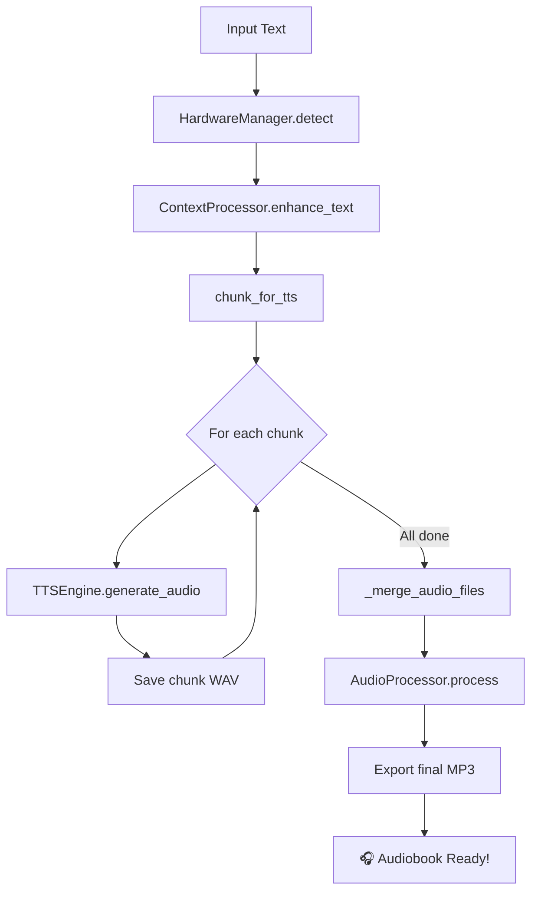

# 🎧 Audio Generation Guide (Text-to-Speech)

## File: `listen/listen.py`

> **Purpose**: Convert text (original, translated, or summarized) into high-quality audiobook audio.

---

## 🎯 What This Script Does

This script is your **audio engine** that:

1. **Detects hardware** (CPU/NVIDIA GPU/AMD GPU)
2. **Enhances text** with emotion and pause markers
3. **Generates audio** using multiple TTS models
4. **Post-processes** audio for consistent quality
5. **Merges chunks** into final audiobook file

---

## 📦 Libraries Used

| Library | Purpose | Better Alternative? |
|---------|---------|---------------------|
| `torch` | PyTorch for ML models | ✅ Required |
| `transformers` | HuggingFace models | ✅ Standard |
| `pydub` | Audio manipulation | ✅ Simple and effective |
| `soundfile` | Audio I/O | ✅ Industry standard |
| `TTS` (Coqui) | Advanced TTS | ✅ Best open-source TTS |

### 🔧 Installation

```bash
# Required dependencies
pip install torch transformers pydub numpy scipy soundfile

# Optional: For Coqui TTS (higher quality)
pip install TTS

# Optional: For context enhancement
pip install ollama
```

---

## 🎙️ TTS Models Overview

### BASIC Tier (CPU, 2-4GB RAM)

| Model | Language | Speed | Quality |
|-------|----------|-------|---------|
| `facebook/mms-tts-hin` | Hindi | ⚡⚡⚡ Fast | ⭐⭐⭐ Good |
| `facebook/mms-tts-eng` | English | ⚡⚡⚡ Fast | ⭐⭐⭐ Good |
| `suno/bark-small` | Multi | ⚡⚡ Medium | ⭐⭐⭐⭐ Better |

### INTERMEDIATE Tier (CPU/GPU, 4-12GB RAM)

| Model | Language | Speed | Quality |
|-------|----------|-------|---------|
| `suno/bark` | Multi | ⚡ Slow | ⭐⭐⭐⭐⭐ Excellent |
| `microsoft/speecht5_tts` | English | ⚡⚡ Medium | ⭐⭐⭐⭐⭐ Very natural |
| `xtts_v2` (Coqui) | Multi | ⚡ Slow | ⭐⭐⭐⭐⭐ Voice cloning |

### ADVANCED Tier (GPU Required, 12-20GB)

| Model | Language | Speed | Quality |
|-------|----------|-------|---------|
| `suno/bark` + processing | Multi | ⚡ Slow | ⭐⭐⭐⭐⭐⭐ Commercial |
| `xtts_v2` + enhancement | Multi | ⚡ Slow | ⭐⭐⭐⭐⭐⭐ Studio quality |

---

## 🧩 Code Structure Breakdown

### 1️⃣ Hardware Detection (Lines 89-146)

```python
class HardwareManager:
    def detect_hardware(self):
        # Check for NVIDIA GPU
        if torch.cuda.is_available():
            self.device = "cuda"
            self.gpu_type = "nvidia"
            print(f"✅ NVIDIA GPU: {torch.cuda.get_device_name(0)}")
            print(f"   Memory: {torch.cuda.get_device_properties(0).total_memory / 1e9:.2f} GB")
        
        # Check for AMD GPU (ROCm)
        elif hasattr(torch.version, 'hip') and torch.version.hip:
            self.device = "cuda"
            self.gpu_type = "amd"
            print(f"✅ AMD GPU (ROCm)")
        
        # CPU fallback
        else:
            self.device = "cpu"
            print(f"ℹ️ Using CPU (no GPU detected)")
```

---

### 2️⃣ Context-Aware Text Processing (Lines 241-346)

```python
class ContextProcessor:
    def enhance_text(self, text):
        if self.tier == "BASIC":
            return self._basic_processing(text)
        elif self.tier == "INTERMEDIATE":
            return self._intermediate_processing(text)
        else:
            return self._advanced_processing(text)  # Uses LLM

    def _basic_processing(self, text):
        """Add pauses at punctuation."""
        text = text.replace('. ', '. [pause] ')
        text = text.replace('। ', '। [pause] ')  # Hindi
        text = text.replace('? ', '? [pause] ')
        text = text.replace('! ', '! [pause] ')
        return text

    def _intermediate_processing(self, text):
        """Add emotion markers based on content."""
        sentences = text.split('.')
        enhanced = []
        
        for sent in sentences:
            if '!' in sent or 'excited' in sent.lower():
                sent = f"[excited] {sent}"
            elif '?' in sent:
                sent = f"[questioning] {sent}"
            elif any(word in sent.lower() for word in ['sad', 'unfortunately']):
                sent = f"[sad] {sent}"
            # ... more emotion detection
        
        return ' [pause] '.join(enhanced)
```

**Markers supported by Bark model**:
- `[pause]` - Add natural pause
- `[excited]` - Upbeat tone
- `[sad]` - Somber tone
- `[questioning]` - Inquisitive inflection
- `[laughing]` - Light, amused tone
- `[whisper]` - Soft voice
- `[shouting]` - Loud projection

---

### 3️⃣ TTS Engine (Lines 348-547)

```python
class TTSEngine:
    def __init__(self, model_name, model_type, device, tier):
        self.model_name = model_name
        self.model_type = model_type  # "vits", "bark", "speecht5", "coqui"
        self.device = device
        self.tier = tier

    def load_model(self):
        if self.model_type == "vits":
            return self._load_vits()
        elif self.model_type == "bark":
            return self._load_bark()
        # ...

    def _load_vits(self):
        """Load VITS model (facebook/mms-tts-*)."""
        self.tokenizer = VitsTokenizer.from_pretrained(self.model_name)
        self.model = VitsModel.from_pretrained(self.model_name).to(self.device)
        return True

    def generate_audio(self, text, output_path):
        if self.model_type == "vits":
            return self._generate_vits(text, output_path)
        elif self.model_type == "bark":
            return self._generate_bark(text, output_path)
        # ...
```

#### VITS Generation (Lines 448-474)

```python
def _generate_vits(self, text, output_path):
    """Generate audio using VITS (fast, good quality)."""
    # Tokenize
    inputs = self.tokenizer(text, return_tensors="pt").to(self.device)
    
    # Generate
    with torch.no_grad():
        output = self.model(**inputs)
    
    # Extract waveform
    waveform = output.waveform[0].cpu().numpy()
    sample_rate = self.model.config.sampling_rate  # Usually 16kHz
    
    # Save
    sf.write(output_path, waveform, sample_rate)
    return output_path
```

#### Bark Generation (Lines 476-512)

```python
def _generate_bark(self, text, output_path):
    """Generate audio using Bark (slower, expressive)."""
    inputs = self.processor(text, return_tensors="pt").to(self.device)
    
    # Tier-based quality settings
    if self.tier == "ADVANCED":
        do_sample = True
        temperature = 0.9      # More expressive
    else:
        do_sample = True
        temperature = 0.7      # Balanced
    
    with torch.no_grad():
        audio_array = self.model.generate(
            **inputs,
            do_sample=do_sample,
            semantic_temperature=temperature
        )
    
    # Bark outputs at 24kHz
    audio_array = audio_array.cpu().numpy().squeeze()
    sf.write(output_path, audio_array, 24000)
    return output_path
```

---

### 4️⃣ Audio Post-Processing (Lines 549-605)

```python
class AudioProcessor:
    def process(self, audio_path):
        if self.tier == "BASIC":
            return audio_path  # No processing
        
        audio = AudioSegment.from_file(audio_path)
        
        if self.tier == "INTERMEDIATE":
            audio = self._normalize_audio(audio)
        
        elif self.tier == "ADVANCED":
            audio = self._normalize_audio(audio)
            audio = self._enhance_quality(audio)
            audio = self._add_subtle_effects(audio)
        
        audio.export(audio_path, format="mp3", bitrate="192k")
        return audio_path

    def _normalize_audio(self, audio):
        """Normalize to -20 dBFS for consistent volume."""
        target_dBFS = -20.0
        change_in_dBFS = target_dBFS - audio.dBFS
        return audio.apply_gain(change_in_dBFS)

    def _enhance_quality(self, audio):
        """Apply dynamic range compression."""
        return audio.compress_dynamic_range(
            threshold=-20.0,
            ratio=4.0,
            attack=5.0,
            release=50.0
        )
```

---

### 5️⃣ Main Generation Flow (Lines 607-780)

```python
class AudioGenerator:
    def generate(self):
        # 1. Read input text
        text = self.read_input()
        
        # 2. Enhance with context markers
        enhanced_text = self.context_processor.enhance_text(text)
        
        # 3. Chunk for TTS
        max_chunk_size = 300 if self.tier == "BASIC" else 500
        chunks = self.context_processor.chunk_for_tts(enhanced_text, max_chunk_size)
        
        # 4. Initialize TTS engine
        model_name, model_type = self.select_model()
        engine = TTSEngine(model_name, model_type, device, self.tier)
        engine.load_model()
        
        # 5. Generate audio for each chunk
        audio_files = []
        for i, chunk in enumerate(chunks):
            chunk_file = f"chunk_{i:03d}.wav"
            engine.generate_audio(chunk, chunk_file)
            audio_files.append(chunk_file)
        
        # 6. Merge chunks
        if len(audio_files) > 1:
            final_audio = self._merge_audio_files(audio_files)
        
        # 7. Post-process
        final_audio = self.audio_processor.process(final_audio)
        
        return final_audio
```

---

## 🚀 How to Use

### Basic Usage

```bash
# Hindi with VITS (fast)
python listen.py -f book_hindi.txt -p huggingface -m facebook/mms-tts-hin -t BASIC

# English with SpeechT5
python listen.py -f book.txt -p huggingface -m microsoft/speecht5_tts -t INTERMEDIATE

# Hindi/English with Bark (expressive)
python listen.py -f book.txt -p huggingface -m suno/bark -t INTERMEDIATE
```

### All Options

```bash
python listen.py \
    -f INPUT_FILE          # Input text file
    -o OUTPUT_DIR          # Output directory (default: current)
    -p PROVIDER            # huggingface or coqui
    -m MODEL               # Model name
    -t TIER                # BASIC / INTERMEDIATE / ADVANCED
    --llm-provider ollama  # For ADVANCED context enhancement
    --llm-model qwen2.5:7b # LLM for emotion detection
    --list-models          # Show available models
    --check-deps           # Check dependencies
```

---

## 🔄 Processing Flow



---

## ⚡ Performance Comparison

| Model | 1000 words | GPU Required? | Quality |
|-------|------------|---------------|---------|
| VITS (mms-tts) | ~10 seconds | No | ⭐⭐⭐ |
| Bark Small | ~30 seconds | Recommended | ⭐⭐⭐⭐ |
| Bark Full | ~60 seconds | Yes | ⭐⭐⭐⭐⭐ |
| XTTS v2 | ~45 seconds | Yes | ⭐⭐⭐⭐⭐ |

---

## 💡 Upgrade Suggestions for Audible Quality

### Current Limitations

| Issue | Current | Audible-Level Fix |
|-------|---------|-------------------|
| Voice variety | Single voice | Multiple narrator voices |
| Emotion | Basic markers | AI-driven emotional analysis |
| Music/SFX | None | Chapter intro music, ambient sounds |
| Format | MP3 only | M4B with chapters |

### Recommended Improvements

1. **Voice Cloning with XTTS**
   ```python
   # Clone narrator voice from sample
   from TTS.api import TTS
   
   tts = TTS(model_name="tts_models/multilingual/multi-dataset/xtts_v2")
   
   # Use reference audio for voice cloning
   tts.tts_to_file(
       text="Book text here",
       file_path="output.wav",
       speaker_wav="narrator_sample.wav",  # 5-10 second reference
       language="hi"
   )
   ```

2. **Chapter-aware M4B Creation**
   ```python
   # Install ffmpeg and mp4v2
   # Create chapters file
   chapters = """
   00:00:00.000 Chapter 1: The Beginning
   00:15:30.000 Chapter 2: The Journey
   00:32:45.000 Chapter 3: The Revelation
   """
   
   # Merge with chapters
   ffmpeg -i audiobook.mp3 -i chapters.txt -map 0 -map_metadata 1 audiobook.m4b
   ```

3. **Better Libraries**

   | Current | Alternative | Benefit |
   |---------|-------------|---------|
   | `pydub` | `pedalboard` (Spotify) | Pro audio effects |
   | None | `music21` | Background music mixing |
   | None | `noisereduce` | Clean up TTS artifacts |
   | `transformers` | `StyleTTS2` | Most natural prosody |

---

## 📊 Output Example

```
🎉 AUDIO GENERATION COMPLETE!
━━━━━━━━━━━━━━━━━━━━━━━━━━━━━━━━━━━━━━━━━━
⏱️  Total time: 12.35 minutes
📦 Chunks processed: 47
💾 Output file: ./audio/bark_20240119_153422.mp3
📊 File size: 45.78 MB
━━━━━━━━━━━━━━━━━━━━━━━━━━━━━━━━━━━━━━━━━━
```
