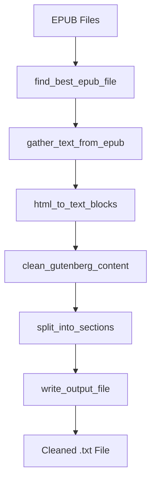

# 📚 EPUB Extraction & Cleaning Guide

## File: `READ_BOOK/exrtact_clean_segregate_epub.py`

> **Purpose**: Extract, clean, and segregate EPUB book content into structured sections for further processing (translation, summarization, audio generation).

---

## 🎯 What This Script Does

This script is the **first step** in your book processing pipeline. It:

1. **Reads EPUB files** (electronic book format)
2. **Extracts text content** from HTML embedded in EPUBs
3. **Removes junk data** (Project Gutenberg headers/footers, metadata, etc.)
4. **Identifies sections** (chapters, prologues, appendices, etc.)
5. **Outputs clean text files** with proper section markers

---

## 📦 Libraries Used

| Library | Purpose | Better Alternative? |
|---------|---------|---------------------|
| `ebooklib` | Parse EPUB files | ✅ **Best option** - Standard for EPUB parsing |
| `BeautifulSoup` (lxml) | Parse HTML content | ✅ `lxml` parser is already optimal |
| `Levenshtein` | Fast string similarity | ✅ Already optimal (with fallback to `difflib`) |
| `tqdm` | Progress bars | ✅ Industry standard |
| `argparse` | Command-line arguments | ✅ Python standard |

### 🔧 Installation

```bash
pip install ebooklib beautifulsoup4 lxml python-Levenshtein tqdm
```

---

## 🧩 Code Structure Breakdown

### 1️⃣ Configuration Section (Lines 36-110)

```python
# Default book catalog for testing
DEFAULT_CATALOG = [
    ("A Christmas Carol", "Charles Dickens"),
    ("Pride and Prejudice", "Jane Austen"),
    # ... more books
]
```

**What it does**: Defines a list of classic books to process. You can override this with a CSV file.

```python
# Section detection patterns
SECTION_PATTERNS = [
    r'^\\s*PROLOGUE\\b',
    r'^\\s*CHAPTER\\s+[IVXLCDM]+\\b',  # Roman numerals
    r'^\\s*CHAPTER\\s+\\d+\\b',          # Arabic numerals
    # ... more patterns
]
```

**What it does**: Regex patterns to identify chapter headings, prologues, epilogues, etc.

---

### 2️⃣ Core Functions Explained

#### `find_best_epub_file()` - Finding the Right Book

```python
def find_best_epub_file(title: str, author: Optional[str], epub_dir: Path) -> Optional[Path]:
    files = list(epub_dir.glob("**/*.epub"))  # Find all EPUBs
    
    for f in files:
        name = f.stem.lower()
        s = similarity(query, name)  # Compare using Levenshtein distance
        # ... scoring logic
```

**How it works**:
- Searches the directory recursively for `.epub` files
- Uses **fuzzy matching** (Levenshtein similarity) to find the best match
- Returns the file with highest similarity score (minimum 0.25 threshold)

**Example**: If you search for "Pride and Prejudice", it will match files like:
- `pride-and-prejudice.epub` ✅
- `pg1342-pride-and-prejudice-austen.epub` ✅
- `random-book.epub` ❌ (low similarity)

---

#### `html_to_text_blocks()` - THE KEY CHANGE

```python
def html_to_text_blocks(html: str) -> List[Tuple[str,str]]:
    soup = BeautifulSoup(html, "lxml")
    blocks: List[Tuple[str,str]] = []

    # Step 1: Handle <pre> blocks (Project Gutenberg style)
    for pre in soup.find_all('pre'):
        text = pre.get_text()
        parts = re.split(r'\n\s*\n', text)  # Split on blank lines
        for p in parts:
            blocks.append(('pre', p.strip()))

    # Step 2: Handle regular HTML tags
    for el in soup.find_all(['h1','h2','h3','p','div','section']):
        if el.find_parent('pre'):
            continue  # Skip if inside <pre>
        txt = el.get_text(separator=" ", strip=True)
        blocks.append((el.name, txt))
```

**Why this matters**: 
- Project Gutenberg EPUBs often put all content inside `<pre>` tags
- Regular parsers miss this content
- This function handles BOTH regular HTML AND pre-formatted text

---

#### `is_section_heading()` - Detecting Chapter Breaks

```python
def is_section_heading(text: str) -> Optional[str]:
    t = text.strip()
    
    # Reject scene breaks like "* * * * *"
    if SCENE_BREAK_REGEX.match(t):
        return None
    
    # Reject very short text
    if len(t) < 3:
        return None
    
    # Check against section patterns
    if SECTION_REGEX.search(t_clean):
        return t_clean.upper()  # Return normalized heading
```

**What it detects**:
- ✅ `CHAPTER I` → Returns `"CHAPTER I"`
- ✅ `PROLOGUE` → Returns `"PROLOGUE"`
- ✅ `Part One: The Beginning` → Returns `"PART ONE: THE BEGINNING"`
- ❌ `* * * * *` → Returns `None` (scene break, not chapter)
- ❌ `Hello there` → Returns `None` (regular paragraph)

---

#### `clean_gutenberg_content()` - Removing Junk

```python
def clean_gutenberg_content(blocks: List[str]) -> List[str]:
    start_markers = [
        "*** START OF THIS PROJECT GUTENBERG EBOOK",
        "*** START OF THE PROJECT GUTENBERG EBOOK",
        # ... many variations
    ]
    
    end_markers = [
        "*** END OF THIS PROJECT GUTENBERG EBOOK",
        # ...
    ]
```

**The cleaning process**:

```
BEFORE:
┌────────────────────────────────────────┐
│ *** START OF PROJECT GUTENBERG EBOOK  │  ← REMOVED
│ Title: Pride and Prejudice             │  ← REMOVED
│ Author: Jane Austen                    │  ← REMOVED
│ Release Date: May 8, 2010              │  ← REMOVED
│ ─────────────────────────────────────  │
│ CHAPTER I                              │  ← KEPT
│ It is a truth universally acknowledged │  ← KEPT
│ ...                                    │  ← KEPT
│ ─────────────────────────────────────  │
│ *** END OF PROJECT GUTENBERG EBOOK    │  ← REMOVED
│ License information...                 │  ← REMOVED
└────────────────────────────────────────┘

AFTER:
┌────────────────────────────────────────┐
│ CHAPTER I                              │
│ It is a truth universally acknowledged │
│ ...                                    │
└────────────────────────────────────────┘
```

---

#### `split_into_sections()` - Creating Structure

```python
def split_into_sections(blocks: List[str]) -> List[Tuple[str, List[str]]]:
    sections: List[Tuple[str, List[str]]] = []
    current_title = None
    current_pars: List[str] = []
    
    for block in blocks:
        heading = is_section_heading(block)
        if heading:
            # Save previous section
            if current_pars:
                sections.append((current_title, current_pars))
            # Start new section
            current_title = heading
            current_pars = []
        else:
            current_pars.append(block)
```

**Output example**:

```python
[
    ("OPENING_CREDITS", ["Pride and Prejudice by Jane Austen"]),
    ("CHAPTER I", ["It is a truth universally acknowledged...", "..."]),
    ("CHAPTER II", ["Mr. Bennet was among the earliest...", "..."]),
    # ...
]
```

---

### 3️⃣ Output Format

The script creates files with **Audible-style markers**:

```
===CHAPTER I===

It is a truth universally acknowledged, that a single man in possession 
of a good fortune, must be in want of a wife.

However little known the feelings or views of such a man may be on his 
first entering a neighbourhood, this truth is so well fixed in the minds 
of the surrounding families, that he is considered as the rightful 
property of some one or other of their daughters.

===CHAPTER II===

Mr. Bennet was among the earliest of those who waited on Mr. Bingley. 
He had always intended to visit him, though to the last always assuring 
his wife that he should not go...
```

---

## 🚀 How to Use

### Basic Usage

```bash
python exrtact_clean_segregate_epub.py \
    --input-dir ./epubs \
    --output-dir ./PROCESSED/1_clean
```

### With Custom Book List

```bash
python exrtact_clean_segregate_epub.py \
    --input-dir ./epubs \
    --output-dir ./PROCESSED/1_clean \
    --csv books.csv
```

Where `books.csv` contains:
```csv
Pride and Prejudice, Jane Austen
A Christmas Carol, Charles Dickens
Dracula, Bram Stoker
```

---

## 🔄 Processing Flow



---

## 💡 Upgrade Suggestions

### Current Limitations

| Issue | Current Behavior | Audible-Level Fix |
|-------|------------------|-------------------|
| **OCR Artifacts** | Not handled | Add regex patterns for common OCR errors |
| **Tables/Figures** | Lost in conversion | Preserve with text descriptions |
| **Footnotes** | Mixed into text | Separate and link back |
| **Languages** | English section patterns only | Add multilingual patterns |
| **Metadata** | Minimal extraction | Extract copyright, publisher, etc. |

### Recommended Improvements

1. **Add AI-powered section detection** for edge cases
2. **Implement character encoding detection** (chardet library)
3. **Add validation reports** with content statistics
4. **Support more formats** (MOBI, AZW3, PDF)

---

## 🐛 Common Issues

| Problem | Cause | Solution |
|---------|-------|----------|
| No text extracted | EPUB uses `<pre>` tags | Already fixed in this version |
| Chapters not detected | Unusual heading format | Add pattern to `SECTION_PATTERNS` |
| Junk still present | New Gutenberg format | Add marker to `start_markers`/`end_markers` |
| Audio EPUB warning | LibriVox files | Normal - these contain no text |

---

## 📁 Output Files

The script generates two outputs:

1. **Cleaned text file**: `{Book Title}__Cleaned_segregated_final.txt`
2. **Processing report**: `processing_report.json` with:
   - Processing timestamp
   - Source and output directories
   - Per-book results with section counts and warnings
