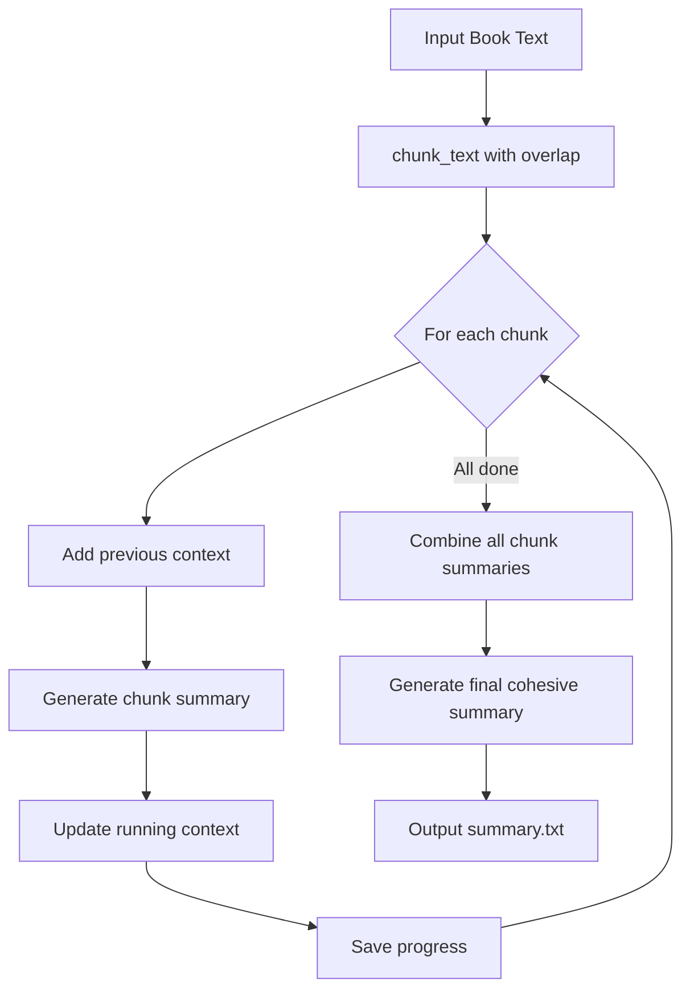

# 📝 Summarization Guide

## File: `summarize/summary-generate.py`

> **Purpose**: Generate context-aware summaries of book content with configurable length and quality settings.

---

## 🎯 What This Script Does

This script creates **intelligent summaries** that:

1. **Processes text in overlapping chunks** for context continuity
2. **Maintains running context** from previous chunks
3. **Supports three length settings**: SHORT, MEDIUM, LONG
4. **Generates final cohesive summary** from chunk summaries
5. **Supports resume** if interrupted

---

## 📦 Libraries Used

| Library | Purpose | Better Alternative? |
|---------|---------|---------------------|
| `ollama` | Local LLM inference | ✅ Best for local models |
| `transformers` | HuggingFace models | ✅ Standard for ML |
| `torch` | PyTorch backend | ✅ Required |
| `colorama` | Colored output | ✅ Cross-platform |

### 🔧 Installation

```bash
pip install ollama colorama transformers torch
```

---

## 📏 Length Specifications

```python
LENGTH_SPECS = {
    "SHORT": {
        "chunk_target": "2-3 sentences",
        "final_ratio": "5-8%",
        "description": "Brief overview hitting only most critical points"
    },
    "MEDIUM": {
        "chunk_target": "4-6 sentences", 
        "final_ratio": "10-15%",
        "description": "Balanced summary covering main ideas and key details"
    },
    "LONG": {
        "chunk_target": "8-12 sentences",
        "final_ratio": "20-25%", 
        "description": "Comprehensive summary preserving nuance and context"
    }
}
```

**Visual comparison**:

```
Original: ████████████████████████████████ 100%

SHORT:    ██░░░░░░░░░░░░░░░░░░░░░░░░░░░░░░ 5-8%
MEDIUM:   ████░░░░░░░░░░░░░░░░░░░░░░░░░░░░ 10-15%
LONG:     ████████░░░░░░░░░░░░░░░░░░░░░░░░ 20-25%
```

---

## 🧩 Code Structure Breakdown

### 1️⃣ Summary Prompts (Lines 53-206)

Three quality tiers with different approaches:

| Tier | Focus | Best For |
|------|-------|----------|
| **BASIC** | Factual accuracy | Quick overviews |
| **INTERMEDIATE** | Thematic analysis | Study guides |
| **ADVANCED** | Literary analysis | Professional use |

```python
SUMMARY_PROMPTS = {
    "BASIC": {
        "system": """You are a professional book summarizer focused on accuracy.
        
        CORE PRINCIPLES:
        - Preserve factual accuracy above all else
        - Capture main ideas, events, and arguments in order
        - NO interpretation, NO opinions, NO embellishment
        - Maintain the author's voice and perspective""",
        
        "chunk_user": """TEXT TO SUMMARIZE:
        \"\"\"{chunk}\"\"\"
        
        CONTEXT FROM PREVIOUS SECTIONS:
        {context}
        
        TARGET LENGTH: {length_target}
        
        Create a factual summary that:
        1. Captures the key information in this section
        2. Connects naturally with what came before
        ..."""
    },
    # INTERMEDIATE and ADVANCED have progressively deeper prompts
}
```

---

### 2️⃣ Text Chunking with Overlap (Lines 214-226)

```python
def chunk_text(text, chunk_words=400, overlap=80):
    """Chunk text with overlap for context preservation"""
    words = text.split()
    chunks = []
    start = 0

    while start < len(words):
        end = start + chunk_words
        chunk = " ".join(words[start:end])
        chunks.append(chunk)
        start = end - overlap  # Overlap for context!
```

**Why overlap?**

```
Without overlap:
Chunk 1: [████████████]
Chunk 2:               [████████████]
         Lost context ↑

With overlap (80 words):
Chunk 1: [████████████████]
Chunk 2:         [████████████████]
                 ↑ Shared context
```

---

### 3️⃣ Progress Tracking (Lines 240-253)

```python
class Progress:
    def __init__(self, path):
        self.path = path
        self.data = self.load()

    def load(self):
        if os.path.exists(self.path):
            return json.load(open(self.path))
        return {
            "done": [],           # Completed chunk numbers
            "context": "",        # Running context
            "chunk_summaries": [] # All chunk summaries
        }

    def save(self):
        json.dump(self.data, open(self.path, "w"), indent=2)
```

**Enables**:
- ✅ Resume after interruption
- ✅ No re-processing of completed chunks
- ✅ Maintains context state

---

### 4️⃣ Model Provider (Lines 255-303)

```python
class Provider:
    def __init__(self, provider, model, device):
        self.provider = provider    # "ollama" or "huggingface"
        self.model = model
        self.device = device

    def generate(self, system, user, max_tokens=1500):
        if self.provider == "ollama":
            out = ollama.chat(
                model=self.model,
                messages=[
                    {"role": "system", "content": system},
                    {"role": "user", "content": user}
                ],
                options={
                    "temperature": 0.2,  # Low for consistent summaries
                    "num_ctx": 8192,
                    "num_predict": max_tokens
                }
            )
            return out["message"]["content"]
```

---

### 5️⃣ Main Processing Loop (Lines 367-431)

```python
# Process each chunk
for i, chunk in enumerate(chunks, 1):
    if str(i) in progress.data["done"]:
        print(f"Skipping chunk {i}/{len(chunks)} (already processed)")
        continue

    # Build prompt with context from previous chunks
    chunk_prompt = prompts["chunk_user"].format(
        chunk=chunk,
        context=context[-2000:],  # Last 2000 chars of context
        length_target=length_spec["chunk_target"]
    )

    result = prov.generate(prompts["system"], chunk_prompt, max_tokens=800)
    result = clean_output(result)
    
    # Update running context
    chunk_summaries.append(result)
    context += "\n\n" + result
    
    # Save progress
    progress.data["done"].append(str(i))
    progress.data["context"] = context
    progress.data["chunk_summaries"] = chunk_summaries
    progress.save()
```

---

### 6️⃣ Final Summary Generation (Lines 394-428)

```python
# After all chunks processed
if chunk_summaries:
    print("► Generating final cohesive summary...")
    
    final_prompt = prompts["final_user"].format(
        summaries="\n\n---\n\n".join(chunk_summaries),
        final_ratio=length_spec["final_ratio"]
    )
    
    final_summary = prov.generate(
        prompts["system"],
        final_prompt,
        max_tokens=2500  # Larger for final summary
    )
    
    # Calculate compression ratio
    final_words = len(final_summary.split())
    compression = (final_words / original_words) * 100
    
    print(f"Original: {original_words} words")
    print(f"Summary: {final_words} words ({compression:.1f}% of original)")
```

---

## 🚀 How to Use

### Basic Usage

```bash
python summary-generate.py book.txt \
    -ol                    # Use Ollama
    -m qwen2.5:7b          # Model
    -t INTERMEDIATE        # Quality tier
    -l MEDIUM              # Length setting
    -o summary.txt         # Output file
```

### All Options

```bash
python summary-generate.py input.txt \
    -ol / -hf              # Provider (Ollama or HuggingFace)
    -m MODEL               # Model name
    -t TIER                # BASIC / INTERMEDIATE / ADVANCED
    -l LENGTH              # SHORT / MEDIUM / LONG
    -o OUTPUT              # Output file
    --chunk-words 500      # Words per chunk
    --overlap 100          # Overlap between chunks
    --resume               # Resume from checkpoint
```

---

## 🔄 Processing Flow



---

## 🎛️ Tuning Parameters

| Parameter | Effect | Recommendation |
|-----------|--------|----------------|
| `temperature` | 0.1 = factual, 0.5 = creative | **0.2** for summaries |
| `chunk_words` | Larger = more context | **400-500** |
| `overlap` | More = better continuity | **80-100** (20% of chunk) |
| `max_tokens` | Longer summaries | **800** per chunk, **2500** final |

---

## 💡 Upgrade Suggestions

### Current Flow

```
Book → Chunks → Chunk Summaries → Final Summary
```

### Audible-Level Flow (Hierarchical)

```
Book → Paragraphs → Paragraph Summaries
       ↓
       Sections → Section Summaries  
       ↓
       Chapters → Chapter Summaries
       ↓
       Book → Book Summary
```

### Recommended Improvements

1. **Hierarchical Summarization**
   ```python
   # First pass: Summarize paragraphs
   paragraph_summaries = summarize_paragraphs(text)
   
   # Second pass: Summarize sections
   section_summaries = summarize_sections(paragraph_summaries)
   
   # Third pass: Summarize chapters
   chapter_summaries = summarize_chapters(section_summaries)
   
   # Final: Book summary
   book_summary = summarize_book(chapter_summaries)
   ```

2. **Key Information Extraction**
   ```python
   # Extract before summarizing
   characters = extract_characters(text)
   locations = extract_locations(text)
   timeline = extract_timeline(text)
   
   # Include in summary prompt
   prompt = f"Key characters: {characters}\nSummarize..."
   ```

3. **Better Libraries**

   | Current | Alternative | Benefit |
   |---------|-------------|---------|
   | Simple chunking | `langchain.text_splitter` | Smart boundaries |
   | Basic prompts | `LangChain chains` | Template management |
   | None | `sumy` | Statistical summarization baseline |

---

## 📊 Output Example

```
✓ Summary complete!
Original: 85,432 words
Summary: 8,543 words (10.0% of original)
Output: summary.txt
```

**Summary structure**:
```
Pride and Prejudice follows the Bennet family in rural England 
during the Regency era. The novel centers on Elizabeth Bennet, 
the second of five daughters, and her developing relationship 
with the wealthy Mr. Fitzwilliam Darcy...

[Seamless narrative continuing through all major plot points]

The novel concludes with marriages for both Elizabeth and 
Jane, demonstrating Austen's critique of mercenary marriages 
while celebrating unions based on true understanding...
```
