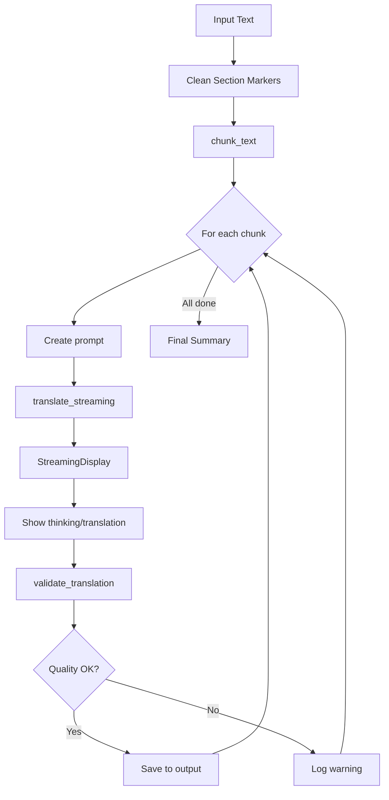

# 🌐 Hindi Translation Guide

## File: `Translation/translate.py`

> **Purpose**: Translate English text to Hindi with real-time streaming, thinking process display, and quality validation.

---

## 🎯 What This Script Does

This script is the **translation engine** of your pipeline. It:

1. **Reads cleaned text** from the EPUB extraction step
2. **Translates to Hindi** using local AI models (Ollama or HuggingFace)
3. **Streams output in real-time** so you can watch the translation happen
4. **Shows "thinking" process** for reasoning models like DeepSeek-R1
5. **Validates translation quality** to detect summarization (a common LLM problem)
6. **Supports resume** if interrupted

---

## 📦 Libraries Used

| Library | Purpose | Better Alternative? |
|---------|---------|---------------------|
| `ollama` | Local LLM inference | ✅ Best for local models |
| `transformers` | HuggingFace models | ✅ Industry standard |
| `torch` | PyTorch backend | ✅ Required for transformers |
| `colorama` | Colored terminal output | ✅ Cross-platform colors |

### 🔧 Installation

```bash
# Core dependencies
pip install ollama colorama

# For HuggingFace support (optional)
pip install transformers torch
```

---

## 🧠 Understanding Model Tiers

The script supports three quality tiers:

```
┌─────────────┬────────────────────┬─────────────────────────────────┐
│ Tier        │ Recommended Models │ Use Case                        │
├─────────────┼────────────────────┼─────────────────────────────────┤
│ BASIC       │ qwen2.5:3b         │ Fast testing, 30-60s per chunk  │
│             │ phi3.5:3.8b        │                                 │
│             │ llama3.2:3b        │                                 │
├─────────────┼────────────────────┼─────────────────────────────────┤
│ INTERMEDIATE│ qwen2.5:7b         │ Good quality, 60-120s           │
│             │ deepseek-r1:7b 🧠  │ Shows thinking process          │
│             │ llama3.1:8b        │                                 │
├─────────────┼────────────────────┼─────────────────────────────────┤
│ ADVANCED    │ qwen2.5:14b        │ Best quality, 2-5min            │
│             │ deepseek-r1:14b 🧠 │ Deep reasoning                  │
│             │ deepseek-r1:32b 🧠 │                                 │
└─────────────┴────────────────────┴─────────────────────────────────┘
```

> 🧠 = "Thinking" models that show their reasoning process

---

## 🧩 Code Structure Breakdown

### 1️⃣ Configuration (Lines 45-90)

```python
# Models that support thinking/reasoning display
THINKING_MODELS = {
    "deepseek-r1:1.5b": {"has_thinking": True, "thinking_tags": ["<think>", "</think>"]},
    "deepseek-r1:7b": {"has_thinking": True, "thinking_tags": ["<think>", "</think>"]},
    # ... more models
}

# Default configuration
DEFAULT_CONFIG = {
    "model": "qwen2.5:3b",
    "chunk_words": 350,      # Words per chunk
    "temperature": 0.5,       # Creativity vs consistency
    "top_p": 0.8,            # Nucleus sampling
    "num_ctx": 16384,        # Context window
    "retry_attempts": 3,      # Retries on failure
}
```

---

### 2️⃣ Translation Prompts (Lines 106-274)

Each tier has carefully crafted prompts to prevent summarization:

```python
TRANSLATION_PROMPTS = {
    "BASIC": {
        "system": """You are a master Hindi literary translator. Your mission: 
        Create translations that feel like they were originally written in Hindi.
        
        🚨 ABSOLUTE RULES (NEVER VIOLATE):
        1. TRANSLATE EVERYTHING - Every word, every sentence
        2. NO SUMMARIZATION - This is faithful translation
        3. CONTEXT PRESERVATION - Maintain narrative flow
        4. ALL DIALOGUE - Every spoken word must be translated
        ...
        """,
        
        "user": """Translate the following English text into Hindi...
        
        English Text:
        \"\"\"
        {chunk}
        \"\"\"
        """
    },
    # INTERMEDIATE and ADVANCED have even more detailed prompts
}
```

**Why so detailed?** LLMs tend to summarize when translating. These prompts fight that tendency.

---

### 3️⃣ Chunking Text (Lines 308-366)

```python
def chunk_text(text, chunk_words=350):
    """Split text into chunks at paragraph boundaries."""
    
    # Detect paragraph breaks
    paragraph_patterns = [
        r'\n\s*\n',           # Double newlines
        r'\r\n\s*\r\n',       # Windows line endings
        r'\n\s{2,}\n',        # Indented paragraphs
    ]
    
    paragraphs = re.split(paragraph_pattern, text)
    
    # Build chunks without breaking paragraphs
    chunks = []
    current_chunk = []
    current_count = 0
    
    for para in paragraphs:
        para_words = len(para.split())
        
        if current_count + para_words > chunk_words:
            chunks.append('\n\n'.join(current_chunk))
            current_chunk = [para]
            current_count = para_words
        else:
            current_chunk.append(para)
            current_count += para_words
```

**Key insight**: Never break in the middle of a paragraph!

---

### 4️⃣ Streaming Display (Lines 443-563)

The `StreamingDisplay` class handles real-time output:

```python
class StreamingDisplay:
    def __init__(self, is_thinking_model=False):
        self.is_thinking_model = is_thinking_model
        self.in_thinking = False
        self.thinking_buffer = ""
        self.translation_buffer = ""
    
    def process_token(self, token):
        # Detect thinking tags
        if '<think>' in token:
            self.in_thinking = True
            self._display_thinking_start()
        
        if '</think>' in token:
            self.in_thinking = False
            self._display_thinking_summary()
        
        # Route token to appropriate display
        if self.in_thinking:
            self.thinking_buffer += token
            self._display_thinking_token(token)  # Blue color
        else:
            self.translation_buffer += token
            self._display_translation_token(token)  # Green color
```

**What you see in terminal**:

```
🧠 THINKING STARTED
━━━━━━━━━━━━━━━━━━━━━━━━━━━━━━━━
🤔 Let me analyze this passage...
🤔 The key characters are Holmes and Watson...
🤔 I should preserve the formal Victorian tone...
━━━━━━━━━━━━━━━━━━━━━━━━━━━━━━━━
🎯 THINKING COMPLETED

▶ Streaming translation...
मिस्टर शेरलॉक होम्स, जो आमतौर पर सुबह बहुत देर तक...
```

---

### 5️⃣ Translation Validation (Lines 386-440)

```python
def validate_translation(original, translated, chunk_num):
    orig_chars = len(original)
    trans_chars = len(translated)
    
    # Check length ratio
    expected_min = orig_chars * 0.6   # Hindi can be 60-150% of English
    expected_max = orig_chars * 1.5
    
    warnings = []
    
    if trans_chars < expected_min:
        warnings.append("⚠️ CRITICAL: Translation too short!")
        warnings.append(f"   Ratio: {trans_chars/orig_chars:.2f}x (expected 0.8-1.2x)")
        warnings.append("   This strongly indicates SUMMARIZATION!")
        severity = "CRITICAL"
    
    # Check sentence count
    orig_sentences = count_sentences(original)
    trans_sentences = count_sentences(translated)
    
    if trans_sentences / orig_sentences < 0.7:
        warnings.append("⚠️ WARNING: Sentence count mismatch!")
```

**Validation catches**:
- ❌ Translation too short (summarization)
- ❌ Too few sentences (condensing)
- ❌ Missing paragraphs

---

### 6️⃣ Model Provider with Streaming (Lines 565-690)

```python
class ModelProvider:
    def __init__(self, provider_type, model_name, device="cpu"):
        self.provider_type = provider_type  # "ollama" or "huggingface"
        self.model_name = model_name
        self.is_thinking = is_thinking_model(model_name)
    
    def translate_streaming(self, system_prompt, user_prompt, temperature, top_p, num_ctx):
        if self.provider_type == "ollama":
            return self._translate_ollama_streaming(...)
        else:
            return self._translate_huggingface(...)
    
    def _translate_ollama_streaming(self, ...):
        # Stream the response
        stream = ollama.chat(
            model=self.model_name,
            messages=[
                {"role": "system", "content": system_prompt},
                {"role": "user", "content": user_prompt}
            ],
            stream=True  # Enable streaming!
        )
        
        for chunk in stream:
            token = chunk['message']['content']
            display.process_token(token)  # Show in real-time
```

---

## 🚀 How to Use

### Quick Start

```bash
# Fast translation (BASIC tier)
python translate.py book.txt -ol -m qwen2.5:3b -t BASIC

# Better quality with reasoning display
python translate.py book.txt -ol -m deepseek-r1:7b -t INTERMEDIATE

# Best quality
python translate.py book.txt -ol -m qwen2.5:14b -t ADVANCED
```

### All Options

```bash
python translate.py input.txt \
    -ol                    # Use Ollama (or -hf for HuggingFace)
    -m qwen2.5:7b          # Model name
    -t INTERMEDIATE        # Quality tier
    -o output_hi.txt       # Output file
    --chunk-words 350      # Words per chunk
    --temperature 0.3      # Lower = more consistent
    --resume               # Resume from checkpoint
```

### List Available Models

```bash
python translate.py --list-models
```

---

## 🔄 Processing Flow



---

## 🎛️ Tuning Parameters

| Parameter | Low Value | High Value | Recommendation |
|-----------|-----------|------------|----------------|
| `temperature` | 0.1 (deterministic) | 0.9 (creative) | **0.3-0.5** for translation |
| `chunk_words` | 200 (fast but choppy) | 500 (slow but contextual) | **350** balanced |
| `top_p` | 0.5 (focused) | 0.95 (diverse) | **0.8-0.9** for variety |

---

## 💡 Upgrade Suggestions

### Current Limitations

| Issue | Current Behavior | Audible-Level Fix |
|-------|------------------|-------------------|
| **Context loss** | Each chunk translated independently | Add sliding context window |
| **Character names** | Sometimes inconsistent | Build character glossary |
| **Technical terms** | May be mistranslated | Add domain glossaries |
| **Batch processing** | One file at a time | Add parallel processing |

### Recommended Improvements for Audible-Quality

1. **Context Memory**
   ```python
   # Add previous translation summary to context
   context = summarize_last_n_chunks(3)
   prompt = f"Context: {context}\n\nTranslate: {chunk}"
   ```

2. **Glossary Support**
   ```python
   # Consistent name transliteration
   GLOSSARY = {
       "Sherlock Holmes": "शेरलॉक होम्स",
       "Watson": "वॉटसन",
       "Baker Street": "बेकर स्ट्रीट"
   }
   ```

3. **Better Libraries**
   
   | Current | Alternative | Benefit |
   |---------|-------------|---------|
   | `ollama` | `vLLM` | 2-3x faster inference |
   | Direct API | `LangChain` | Better prompt management |
   | None | `sentence-transformers` | Semantic similarity validation |

---

## 🐛 Troubleshooting

| Problem | Cause | Solution |
|---------|-------|----------|
| Translation too short | Model summarizing | Use ADVANCED tier prompts |
| Gibberish output | Wrong model | Check `ollama list` |
| Slow translation | Large context | Reduce `chunk_words` |
| Hindi mixed with English | Inconsistent model | Lower temperature |
| Thinking not showing | Model doesn't support it | Use `deepseek-r1` models |

---

## 📊 Quality Metrics

The script tracks these metrics:

```
🎉 TRANSLATION COMPLETE!
━━━━━━━━━━━━━━━━━━━━━━━━━━━━━━
⏱️  Time:       45.2 minutes
📦 Chunks:     127
⚡ Avg/chunk:  21.4s
📝 Input:      152,340 chars
📝 Output:     168,542 chars
📊 Ratio:      1.11x          ← Good! Near 1.0
⚠️  Warnings:   3             ← Should be 0
🚨 Critical:   0              ← Must be 0
━━━━━━━━━━━━━━━━━━━━━━━━━━━━━━
```
